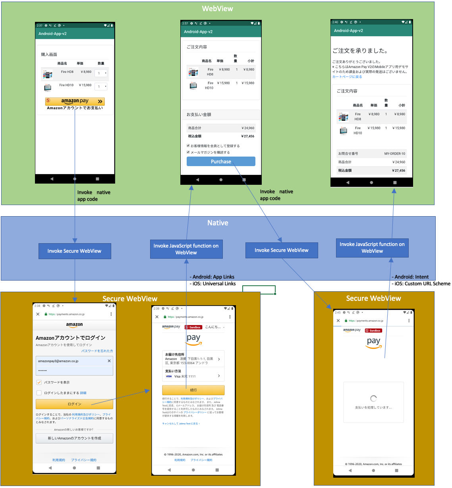
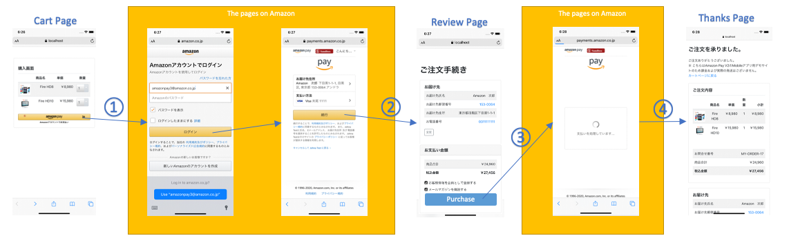
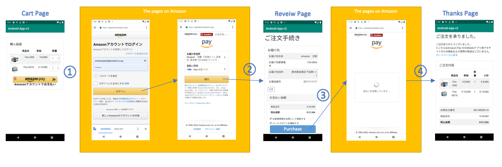

# 本サンプルアプリについて
SmartPhone上でAmazon Payを使って商品を購入する、モバイルアプリのサンプル実装です。  
本サンプルアプリでは、Amazon Payの処理についてはモバイルアプリから使えるSecureなブラウザ技術である、  
  * Android: Chrome Custom Tabs  
  * iOS: SFSafariViewController  

を起動して実行しており、実行が終わるとまたアプリ側に処理を戻しています。  
※ 本ドキュメント 及び サンプルアプリのコード内では、「Chrome Custom Tabs」と「SFSafariViewController」の両方を合わせて「*Secure WebView*」と呼んでおります。  

その他の部分は、通常のAmazon Payの実装と同じです。  
よって、下記Amazon Pay開発者用ページを参考にご実装いただけますし、また通常のPC/Mobileのブラウザ向けのページとソースコードの多くを共有することができます。  
https://amazon-pay-v2.s3-ap-northeast-1.amazonaws.com/V2_Documents.html  

本サンプルアプリも、通常のPC/Mobileのブラウザ向けの一般的なAmazon Payの実装と、モバイルアプリ(Android/iOS)向けの実装が同じコード上で実現されています。

モバイルアプリから使うことができるブラウザ技術としては、Secure WebViewの他にもWebViewがあります。  
WebViewはSecurity上の理由でAmazon Payではサポート対象となっておらず、WebViewで実装されているモバイルアプリの場合でも、そのままではAmazon Payを安全にご導入いただけません。  
参考: https://developer.amazon.com/ja/docs/amazon-pay-onetime/webview.html  
WebViewで構築されたアプリの場合でも、本サンプルアプリのやり方に従えばサポート対象となる安全な形での実装が可能ですので、是非ご活用下さい。  

本サンプルアプリはサーバー側の実装の[nodejs](nodejs/README.md)と、[android](android/README.md)、[ios](ios/README.md)の3つのプロジェクトで構成されており、それぞれのセットアップ方法 及び 利用している技術要素に関する説明も、それぞれのREADMEをご参照下さい。  

# 動作環境
Android 7以降: Google Chrome 64以降  
iOS バージョン11.2以降: Safari Mobile 11以降  
[参考] https://pay.amazon.com/jp/help/202030010

# 概要
本サンプルアプリはAndroid, iOS共に下記の動画のように動作します。

  

この動作は、下記の図のように  

* WebView ←→ Native ←→ Secure WebView  

が連携することで実現しています。

本サンプルアプリはWebViewで作成されておりますが、図を見ると分かる通り必ず一度Nativeの処理を経由してからSecure WebViewとやり取りをしています。
よってNativeアプリの場合でも、本サンプルアプリを参考にAmazon Payをご実装いただくことが可能です。  

# Amazon Payを実装するために必要なタスクの概要
## [参考] PC・MobileのBrowser版への実装で必要なタスク
Amazon PayをPC・MobileのBrowserに実装した場合、一般的には下記のようなFlowになります。  

  

必要なタスクは、下記の通りです。  

1. カートページや商品ページにAmazon Payボタンを配置します。
    - この時、②でリダイレクトされる、購入ページのURLを設定します。
2. ②のリダイレクト時のURLに「amazonCheckoutSessionId」が渡されます。
    - Server側で「amazonCheckoutSessionId」をパラメタにAmazon Pay APIを呼び出し、購入者の氏名・住所情報を取得して購入ページに反映して表示します。
3. 購入ボタンクリック時に下記の処理を行います。
    - Server側で「amazonCheckoutSessionId」をパラメタにAmazon Pay APIを呼び出し、金額などの決済に必要な情報と、④のリダイレクト先のThanksページのURLを設定します。
    - このAPIの戻り値の中に③の「支払い処理ページ」へのURLが含まれているので、そちらにリダイレクトします。
4. Amazon側の画面にて与信などの決済処理が完了すると自動的に④のリダイレクトが発生します。
    - Server側で「amazonCheckoutSessionId」をパラメタにAmazon Pay APIを呼び出してAmazon Payの支払いSessionを完了させて、Thanksページを表示します。

## モバイルアプリ版への実装で必要なタスク
Amazon Payをモバイルアプリに実装する場合も、基本的なFlowは同じで、一般的には下記のようになります。  

  

必要なタスクも基本的にはBrowserと多くは共通ですが、Amazon側の処理をSecure WebView上で実行しなくてはいけないため、一部追加のタスクもあります。  
Browserと違う部分に関しては、***太字***で表記します。  

### WebViewアプリの場合
下記のとおり、多くの部分がBrowserと共通になります。

1. カートページや商品ページに ***「Amazon Payボタン」の画像*** を配置します。
    - ***この画像をタップした時、「自動的にAmazonログイン画面に遷移させるページ」([android](android/README.md)、[ios](ios/README.md)にて後述)をSecure WebViewで表示します。***
    - この時、②でリダイレクトされる、***Nativeコードを起動するURL(iOS: Universal Links, Android: Applinks)*** を設定します。
2. ②のリダイレクト時のURLに「amazonCheckoutSessionId」が渡されます。
    - ***Nativeコードが起動するので、URLに含まれる「amazonCheckoutSessionId」を取得し、これを付与してWebViewを購入ページにリダイレクトさせます***
    - Server側で「amazonCheckoutSessionId」をパラメタにAmazon Pay APIを呼び出し、購入者の氏名・住所情報を取得して購入ページに反映して表示します。
3. 購入ボタンクリック時に下記の処理を行います。
    - Server側で「amazonCheckoutSessionId」をパラメタにAmazon Pay APIを呼び出し、金額などの決済に必要な情報と、④のリダイレクト先の ***Nativeコードを起動する「中継用のページ」([android](android/README.md)、[ios](ios/README.md)にて後述)*** のURLを設定します。
    - このAPIの戻り値の中に③の「支払い処理ページ」へのURLが含まれているので、***Secure WebViewで表示します***。
4. Amazon側の画面にて与信などの決済処理が完了すると自動的に④のリダイレクトが発生します。
    - ***中継用ページによりNativeコードが起動するので、WebViewをThanksページにリダイレクトさせます***。
    - Server側で「amazonCheckoutSessionId」をパラメタにAmazon Pay APIを呼び出してAmazon Payの支払いSessionを完了させて、Thanksページを表示します。

### Nativeアプリの場合
下記のとおり、多くの部分がBrowserと共通となります。  
Nativeアプリの場合には画面の表示などはBrowserとは別に実装する必要はありますが、Secure WebView上の処理やServer側の処理などは共通です。  

1. カートページや商品ページに ***「Amazon Payボタン」の画像*** を配置します。
    - ***この画像をタップした時、「自動的にAmazonログイン画面に遷移させるページ」([android](android/README.md)、[ios](ios/README.md)にて後述) をSecure WebViewで表示します。***
    - この時、②でリダイレクトされる、***Nativeコードを起動するURL(iOS: Universal Links, Android: Applinks)*** を設定します。
2. ②のリダイレクト時のURLに「amazonCheckoutSessionId」が渡されます。
    - ***Nativeコードが起動するので、URLに含まれる「amazonCheckoutSessionId」を取得します***
    - Server側で「amazonCheckoutSessionId」をパラメタにAmazon Pay APIを呼び出し、購入者の氏名・住所情報を取得して購入ページに反映して表示します。
3. 購入ボタンクリック時に下記の処理を行います。
    - Server側でAmazon Pay APIを呼び出し、金額などの決済に必要な情報と、④のリダイレクト先の ***Nativeコードを起動する「中継用のページ」([android](android/README.md)、[ios](ios/README.md)にて後述)*** のURLを設定します。
    - このAPIの戻り値の中に③の「支払い処理ページ」へのURLが含まれているので、***Secure WebViewで表示します***。
4. Amazon側の画面にて与信などの決済処理が完了すると自動的に④のリダイレクトが発生します。
    - ***中継用ページによりNativeコードが起動します***。
    - Server側で「amazonCheckoutSessionId」をパラメタにAmazon Pay APIを呼び出してAmazon Payの支払いSessionを完了させて、Thanksページを表示します。

# 本サンプルアプリの詳細と動かし方の確認
最初に、[nodejs](nodejs/README.md)を参考に、Webアプリケーション側を動かして下さい。こちらは通常のブラウザからでも動作確認が可能です。  
その後に[android](android/README.md)と[ios](ios/README.md)を参考に、モバイルアプリを動かして下さい。  
