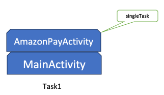

# Android版サンプルアプリのアプリ切替時の挙動の改善について

Android版のサンプルアプリの、2023/09/29よりも前のバージョンでは、Amazon Payの画面を表示するSecure WebView(Chrome Custom Tabs)が、別のアプリを切り替えようとすると自動的にCloseしてしまうという制限がありました。  

  

購入フローの途中でアプリを切り替えること自体がレアケースであるため、今までこの制限は問題になっておりませんでした。  
ところが、現在Amazon PayではSMSやEメールを用いた2要素認証の導入が一部で始まっております。この2段階認証がAndroidアプリで発動した場合、ほとんどのケースでBuyerは同一端末上のSMSアプリやEメールアプリを起動して認証を行うことになり、結果的に購入フローの途中でアプリ切替が発生してAmazon Payの処理実行中のSecure WebViewが閉じられてしまい、購入フローが失敗する結果に繋がってしまいます。  

この問題を回避するため、2023/09/29以降の現バージョンのAndroid版サンプルアプリでは、アプリを切替えてもSecure WebView(Chrome Custom Tabs)がCloseしないよう、改善が加えられております。  
下記動画では現バージョンでアプリを切替ながら購入フローを実行しておりますが、問題なく購入に成功していることが分かるかと思います。  

  

修正量自体は、Androidアプリ側が40〜50行程度、Web側が静的htmlファイル一つのみで20行弱程度と、軽微です。
ここでは以前のバージョンをご参考にAndroidアプリをご実装された方が内容を理解して簡単に改修を行えるよう、前バージョンと現バージョンの違いの概要を述べ、具体的な修正内容について説明いたします。  

## 前バージョンのSecure WebView起動・Closeの処理概要

Androidには、Secure WebView(Chrome Custom Tabs)をプログラムで閉じる方法が用意されておらず、iOS側のようにAmazon Payの画面からアプリに処理が移った後でSecure WebViewをCloseするような実装は不可能です。  
この問題に対処するため、前バージョンではSecure WebView起動時に「FLAG_ACTIVITY_NO_HISTORY」というオプションを利用しておりました。このオプションにより、他のActivityに処理が移ると自動的にSecure WebViewがCloseされるようになります。  
具体的には、Amazon Payの購入フローを起動するとき、  

  

MainActivityからSecure WebViewを「FLAG_ACTIVITY_NO_HISTORY」を付与して起動します。  
この時、オプションの指定により、スタックに積まれるのではなく別のTaskとして起動します。  

  

Amazon Pay側からアプリに戻る時、AmazonPayActivityが起動されます。  

  

「FLAG_ACTIVITY_NO_HISTORY」により、Secure WebViewは自動的にCloseされます。  

  

その後のAmazonPayActivityは自動的にfinishし、MainActivityに処理が戻ります。  

  

しかし、この「FLAG_ACTIVITY_NO_HISTORY」こそがアプリ切替時の制限の原因で、このオプションを指定すると処理が移った先が他のアプリであっても自動的にSecure WebViewがCloseしてしまいます。  
よって現バージョンでは、「FLAG_ACTIVITY_NO_HISTORY」を使わずに同様の購入フローを実現しております。  

## 現バージョンのSecure WebView起動・Closeの処理概要

現バージョンでは、「launchModeでsingleTaskを指定されたActivityが起動されると、スタックの上に積まれたActivityがあればそれを廃棄してからStartする」という挙動を利用して、Secure WebView(Chrome Custom Tabs)をCloseしています。  
具体的には、Amazon Payの購入フローを起動するとき、  

  

直接Secure WebViewを起動するのではなく、まずはlaunchModeを「singleTask」に設定したAmazonPayActivityを起動します。  

  

AmazonPayActivityは起動されると、自動的にSecure WebViewを起動します。この時、スタック上でAmazonPayActivityの上にSecure WebViewが積まれるよう、オプションを指定します。  

  

Amazon Pay側からアプリに戻る時、AmazonPayActivityが起動されます。  

  

AmazonPayActivityは「singleTask」なので、起動時にスタックの上に積まれているSecure WebViewを廃棄してからStartします。  

  

その後のAmazonPayActivityは自動的にfinishし、MainActivityに処理が戻ります。  

  

## 前バージョン・現バージョンへの変更点概要
前バージョンから現バージョンへの主な変更点は下記の2点です。  
(1) AmazonPayActivityのlaunchModeにsingleTaskを指定  
(2) Secure WebViewをAmazonPayActivity経由での起動する  

その他、下記の2点の細かい変更点もあります。  
(3) 中継用ページのAmazonPayActivityの自動起動が発動しなかった場合の対処  
(4) Secure WebViewが左上の「X」ボタンによりCloseされた場合の対処  
次の章にて、詳細を記述します。  

## 前バージョン・現バージョンへの変更点詳細

### (1) AmazonPayActivityのlaunchModeにsingleTaskを指定

AndroidManifest.xmlにて、AmazonPayActivityの定義に下記のようにlaunchMode指定を追加します。  

```xml
        <activity android:name=".AmazonPayActivity"
            android:launchMode="singleTask">
```

これにより、Secure WebViewからAmazonPayActivityを起動する処理で実行されるメソッドが「onCreate」から「onNewIntent」に変更になるので、合わせて変更します。  

```java
                :
    // protected void onCreate(Bundle savedInstanceState) {
    //     super.onCreate(savedInstanceState);
    //           ↓↓↓
    protected void onNewIntent(Intent intent) {
        super.onNewIntent(intent);
        this.isKicked = true;

        if (intent.getScheme().equals("https")) {
            String appLinkAction = intent.getAction();
                :
```

### (2) Secure WebViewをAmazonPayActivity経由で起動する

MainActivity.javaで直接Secure WebViewを起動していた処理を、AmazonPayActivityを経由して起動するよう変更します。  
またこの時AmazonPayActivityが確実にスタック上でMainActivityの上に積まれるようにするため、Intentを起動するContextをApplicationContextからMainActivity自身に変更します。  

```java
public class MainActivity extends AppCompatActivity {
        :
    private void invokeSecureWebview(Context context, String url) {
        // CustomTabsIntent tabsIntent = new CustomTabsIntent.Builder().build();
        //           :
        // // Chrome Custom Tabsの起動
        // tabsIntent.launchUrl(context, Uri.parse(url));
        //           ↓↓↓
        Intent intent = new Intent(context, AmazonPayActivity.class);
        intent.putExtra("url", url);
        context.startActivity(intent);
    }

    @JavascriptInterface
    public void login() {
        Log.d("[JsCallback]", "login");
        // invokeAppLoginPage(getApplicationContext());
        //           ↓↓↓
        invokeAppLoginPage(this);
    }

    @JavascriptInterface
    public void auth(String url) {
        Log.d("[JsCallback]", "auth");
        // invokeAuthorizePage(getApplicationContext(), url);
        //           ↓↓↓
        invokeAuthorizePage(this, url);
    }
        :
```

AmazonPayActivityでは起動後に実行されるonCreateにて、Secure WebViewを起動するよう変更します。Secure WebViewを起動する「invokeSecureWebview」メソッドは、前バージョンではMainActivity.javaに実装されていたものなので、コピーします。  
なお、前バージョンでSecure WebView起動時に指定していたオプションは今回不要となるため、全て削除します。  

```java
public class AmazonPayActivity extends AppCompatActivity {
        :
    protected void onCreate(Bundle savedInstanceState) {
        super.onCreate(savedInstanceState);
        setContentView(R.layout.activity_amazon_pay);
        this.isKicked = true;

        Intent intent = getIntent();
        Log.d("[Intent]", "intent received!");
        Log.d("[Intent]", intent.getStringExtra("url"));
        invokeSecureWebview(this, intent.getStringExtra("url"));
    }
        :
    private void invokeSecureWebview(Context context, String url) {
        CustomTabsIntent tabsIntent = new CustomTabsIntent.Builder().build();

        // 起動するBrowserにChromeを指定
        // Note: Amazon Payでは他のブラウザがサポート対象に入っていないため、ここではChromeを指定している.
        // [参考] https://pay.amazon.com/jp/help/202030010
        // もしその他のChrome Custom Tabs対応のブラウザを起動する必要がある場合には、下記リンク先ソースなどを参考に実装する.
        // [参考] https://github.com/GoogleChrome/custom-tabs-client/blob/master/shared/src/main/java/org/chromium/customtabsclient/shared/CustomTabsHelper.java#L64
        tabsIntent.intent.setPackage("com.android.chrome");

        //　↓↓↓ 全て削除　↓↓↓
        // // 別のActivityへの遷移時に、自動的にChrome Custom Tabsを終了させるためのフラグ設定.
        // tabsIntent.intent.addFlags(Intent.FLAG_ACTIVITY_NEW_TASK);
        // tabsIntent.intent.addFlags(Intent.FLAG_ACTIVITY_CLEAR_TOP);
        // // Chrome Custom Tabs終了時に、Historyとして残らないようにするためのフラグ設定.
        // tabsIntent.intent.addFlags(Intent.FLAG_ACTIVITY_NO_HISTORY);
        //　↑↑↑ 全て削除　↑↑↑

        // Chrome Custom Tabsの起動
        tabsIntent.launchUrl(context, Uri.parse(url));
    }
        :
```

### (3) 中継用ページのAmazonPayActivityの自動起動が発動しなかった場合の対処

Secure WebView上の支払い処理ページからアプリに戻る処理を担当する「中継用ページ」(dispatcher.html)では、ページ読み込み時にJavaScriptでAmazonPayActivityを起動するIntentを発動することで、自動的にアプリに戻ることができるようになっています。  
前バージョンでは単純に下記のように実装されておりました。  

```html
    :
<script type="text/javascript" charset="utf-8">
    function getURLParameter(name, source) {
        return decodeURIComponent((new RegExp('[?|&amp;|#]' + name + '=' +
                        '([^&;]+?)(&|#|;|$)').exec(source) || [, ""])[1].replace(/\+/g, '%20')) || null;
    }

    // 自動的にアプリに戻る
    const client = getURLParameter("client", location.search);
    location.href = client === 'iosApp' 
        ? 'amazonpay-ios-v2://thanks'
        : 'intent://amazon_pay_android_v2#Intent;package=com.amazon.pay.sample.android_app_v2;scheme=amazon_pay_android_v2;end;';
</script>
    :
```

しかし、別のアプリへの切替が行われてアプリがBackgroundプロセスになった場合に、Androidではこのページ読み込み時のIntentが発動せず、アプリに戻れずに中継用ページが表示され続けてしまうケースがありました。  
現バージョンではこのケースに備えて、アプリに戻れなければ「アプリに戻る」ボタンを表示して、Buyerがこのボタンをタップすることによりアプリに戻って購入フローが完了できるよう対処しています。  

```html
    <div id="white_cover" style="width:100%; height:100vh; background-color:#fff; position:relative; z-index:1000; display:block;"></div>
    <div class="container">
        <br>
        <a id="backToApp" href="#" class="btn btn-info btn-lg btn-block">
            Amazon Pay サンプルアプリに戻る
        </a>
    </div>
    <script>
        function getURLParameter(name, source) {
            return decodeURIComponent((new RegExp('[?|&amp;|#]' + name + '=' +
                            '([^&;]+?)(&|#|;|$)').exec(source) || [, ""])[1].replace(/\+/g, '%20')) || null;
        }

        // 自動的にアプリに戻る
        const client = getURLParameter("client", location.search);
        location.href = client === 'iosApp' 
            ? 'amazonpay-ios-v2://thanks'
            : 'intent://amazon_pay_android_v2#Intent;package=com.amazon.pay.sample.android_app_v2;scheme=amazon_pay_android_v2;S.mode=thanks;end;';

        // アプリがBackgroundになるなどして自動で戻れなかった場合に備え、1秒後に「アプリに戻る」ボタンを表示
        document.getElementById("backToApp").href = client === 'iosApp' 
            ? 'amazonpay-ios-v2://thanks'
            : 'intent://amazon_pay_android_v2#Intent;package=com.amazon.pay.sample.android_app_v2;scheme=amazon_pay_android_v2;S.mode=thanks;end;';
        setTimeout(() => document.getElementById('white_cover').style.display = 'none', 1000);
    </script>
```

なお、もちろん「自動的にアプリに戻る」処理が発動するケースもあり得ます。その場合に一瞬だけ「アプリに戻る」ボタンが表示されると、まるで画面で何か問題が生じたように見えてしまいます。  
これを防ぐため、上記ではページが読み込み時にすぐに「アプリに戻る」ボタンを表示せず、1秒待ってから表示するよう実装しています。  

### (4) Secure WebViewが左上の「X」ボタンによりCloseされた場合の対処 

以上により、通常の購入フローでは問題なくBuyerは購入できるのですが、Secure WebView(Chrome Custom Tabs)には左上にCloseするための「X」ボタンが用意されており、こちらをBuyerがタップする可能性があります。  
この時、何の対処もしていないと、スタックにAmazonPayActivityが残ったままになってしまいます。  

  

AmazonPayActivityには画面を操作するような処理は実装されていないため、下記の動画のように真っ白な画面が表示されてBuyerがアプリを操作できなくなってしまいます。  

  

これを防ぐために、AmazonPayActivity.javaでは「isKicked」というフラグを使い、Secure WebView上で「X」ボタンがタップされたとき( ＝ onCreate/onNewIntentを経由しないでonResumeが実行されたとき )にfinishするよう対処しています。  

```java
public class AmazonPayActivity extends AppCompatActivity {

    private boolean isKicked = false;

    protected void onCreate(Bundle savedInstanceState) {
        super.onCreate(savedInstanceState);
        setContentView(R.layout.activity_amazon_pay);
        this.isKicked = true;
            :
    }

    @Override
    protected void onNewIntent(Intent intent) {
        super.onNewIntent(intent);
        this.isKicked = true;
            :
    }

    @Override
    protected void onResume() {
        super.onResume();

        // Secure WebViewを左上の「X」ボタンで閉じられた場合、元の画面に戻すために本Activityを自動でfinishさせる
        if(!isKicked) {
            this.finish();
        }
        isKicked = false;
    }
            :
```

これにより、下記のようにMainActivityに無事に戻れるようになります。  

  
