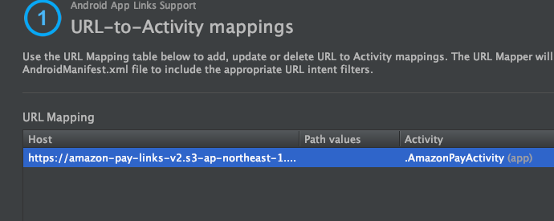

# インストール方法

## 注意事項 1
先にWebアプリケーション側にあたる、[nodejs](../nodejs/README.md)側をインストールして下さい。

## 注意事項 2
本サンプルアプリのAndroid版は、下記の条件を満たす場所にこの後の手順で生成する設定ファイルを配置する必要あるため、条件を満たすサーバーかクラウドサービスのアカウントを保有していないと正しく動かせません。  
  * httpsでファイルにアクセスできること(自己証明書ではなく、Android OSが認識できる正しい証明書を使っていること)  
  * ファイル取得時のContent-Typeは「application/json」とすること  
  * ファイルは「ドメインのルート/.well-known/」の下に配置すること  

本サンプルアプリではこの目的で、[Amazon S3](https://aws.amazon.com/jp/s3/)を利用しています。こちらはアカウントをInternet上で簡単に取得でき、世界中で広く使われており、利用方法などの情報も多く、12ヶ月間 5GBの無料利用枠もあるため、お勧めです。

こちらがすぐに準備できない場合は、iOS版も動作はほとんど同じであり、上記がなくても本サンプルを動作させることが可能なので、そちらを先に試すことをお勧めします。  

## プロジェクトのOpenとサンプルアプリの起動
本プロジェクトは、[Android Studio(無料)](https://developer.android.com/studio/)で開きます。そのほかのIDEでも開くことはできますが、ここでは上記のIDEでの開き方を説明します。  
まずはAndroid Studioを立ち上げます。  
*※ 下記の画面になっていない場合は、Android Studioで開いているプロジェクトを全て閉じてください。*  

「Import Project」 → cloneしたプロジェクトを選択 → 「Open」  
プロジェクトが開いてGradleのbuildが始まりますので、終わるまで数分お待ちください。  
終了したら、Menuの「Run」→「Run app」か、画面上部の「Run app」ボタンより、applicationを起動してください。

下記のようなapplicationを実行するAndroidデバイス or Virtual Device(Emulatorで起動される、仮想的なAndroidデバイス)を選択する画面が開きます。今回はEmulatorでの起動方法を説明します。  
「Create New Virtual Device」をクリックします。  

今回のサンプルはAPI Level 24 以上で動作しますので、該当するVersionのVirtual Deviceがあればそちらを選択します。
そうでなければ、ここで「Create New Virtual Device」をクリックして、Virtual Deviceを作成します。  

左側の「Category」で「Phone」を選択し、開発に用いたい端末を選択します。  
*※特にこだわりがなければ、デフォルトで選択されているもので構いません。*  
「Next」をクリックします。

API Level 24 より上のバージョンより好きなものをを選んで、「Next」。  
*※まだDownloadされていない場合には、「Download」より、画面の指示に従ってDownloadしてください。*

「Finish」でVirtual Deviceの生成が開始されますので、数分お待ちください。  
生成が完了すると、生成されたVirtual Deviceが選択できるようになるので、こちらを選択して「OK」。

Emulatorが立ち上がり、サンプルアプリが起動します。(1〜2分かかります。)  


## 自己証明書のインストール
今回のサンプルでは、server側のSSL証明書に自己証明書が使用されているため、サンプルアプリを正しく動作させるためにはその自己証明書をAndroid側にInstallする必要があります。  
ここでは、Emulatorで起動したVirtual DeviceへのInstall方法を説明します。

1. PIN lockの設定  
Androidではセキュリティのため、PINを設定しないとSSL証明書をInstallできません。  
設定画面を開き、セキュリティの設定より「画面のロック(Screen lock)」よりPINを設定してください。  
*※設定画面の開き方や各種設定は、端末やOSのバージョンによっても変わりますので、もし分からなければGoogleなどで検索してお調べください。  
参考までに、代表的な設定画面の開き方としては、アプリ一覧アイコンをクリックして選択する、ホーム画面で下からスワイプしてアプリ一覧を出して選択する、などがあります。*  
  

2. SSL自己証明書のDownload & Install  
Chromeを立ち上げ、下記のURLにアクセスします。  
https://10.0.2.2:3443/static/crt/sample.crt  
下記のように警告が出るので、「ADVANCED」→「PROCEED TO 10.0.2.2(UNSAFE)」  
  
「CONTINUE」  
  
「ALLOW」  
  
「DOWNLOAD」  
  
PINを聞かれるので、先ほど設定した値を入力します。  
表示された証明書Install画面にて、名前の欄に適当な名前を入力し、「VPN and apps」が選択されていることを確認して、「OK」をクリックすればインストール完了です。  
  

## Applinksの設定
本サンプルアプリでは、Applinksという技術を利用してSecure WebView → Nativeアプリの起動を行っています。  
Applinksを使うためには、専用の設定ファイル(assetlinks.json)を生成して下記条件の場所に配置する必要があります。
  * httpsでファイルにアクセスできること(自己証明書ではなく、iOSが認識できる正しい証明書を使っていること)  
  * ファイル取得時のContent-Typeは「application/json」とすること  
  * ファイルは「ドメインのルート/.well-known/」の下に配置すること  

上記については準備ができているものとし、設定ファイルの生成方法と配置方法を説明します。  

### 設定ファイルの生成
「Tool」→「App Links Assistant」を起動します。  


起動したApp Links Assistantの①の、「Open URL Mapping Editor」をクリックします。  


「URL Mapping」の表に一つ登録されていますので、こちらをダブルクリックします。  


Hostの「amazon-pay-links-v2.s3-ap-northeast-1.amazonaws.com」の部分を、準備したサーバーのドメインに書き換えて「OK」をクリックします。  


次に③の、「Open Digital Asset Links File Generator」をクリックすると下記が開くので、「Generate Digital Asset Links file」をクリックします。  


「Save File」ボタンが出てきますので、こちらをクリックすると生成された定義ファイルの「assetlinks.json」を任意のFolderに保存できます。  


### 設定ファイルの配置と検証
用意したサーバーのDomainルートに、「.well-known」という名前のディレクトリを作成し、定義ファイル「assetlinks.json」を配置します。  
※ Content-Typeが「application/json」になるよう、設定する必要があります。  

④の「Test App Links」をクリックすると、Emulator上で検証できます。  
下記ダイアログが開くので、「Run Test」ボタンをクリックします。  


Emulator上での検証がOKなら、下記のように検証OKのメッセージが出力されます。


「../nodejs/app.js」を開いて、「App Login Screen」を下記のように書き直します。  
「[YOUR-SERVER-DOMAIN]」には上記サーバーのドメインを入れます。  

```js
//-------------------
// App Login Screen
//-------------------
app.get('/appLogin', async (req, res) => {
    if(req.query.client === 'androidApp') {
        res.render('appLogin.ejs', calcConfigs(`https://[YOUR-SERVER-DOMAIN]/redirector_local-${req.query.client}.html?token=${req.query.token}`));
    } else {
        res.render('appLogin.ejs', calcConfigs(`https://amazon-pay-links-v2.s3-ap-northeast-1.amazonaws.com/redirector_local-${req.query.client}.html?token=${req.query.token}`));
    }
});
```

あとはnodejsを再起動して、Emulator上でサンプルアプリを立ち上げて動作をご確認ください。
