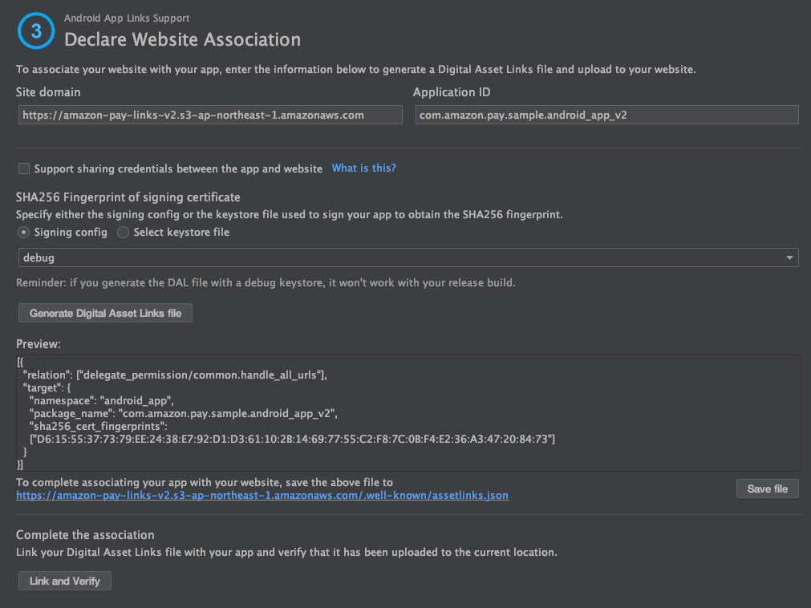

# Techniques to launch apps from Secure WebView
In this sample application, we use "Applinks" and "Intent" to launch the application from Secure WebView, which have the following pros and cons respectively.
- Applinks  
  - Pros : Secure because you can launch the specified mobile app without fail.
  - Cons : Triggered only when the user taps the Link.
- Intent
  - Pros : Can be triggered from JavaScript
  - Cons : Due to the way it works, the risk that a malicious app will be launched instead cannot be completely eliminated.

In this sample application, we have taken these characteristics into consideration and utilized each of them.  
Each of them is explained below.

## Applinks
Applinks is a function that can launch a registered app when a specific URL Link is tapped on Chrome.  
The mapping between that specific URL and the mobile app is defined in a JSON file.  
The JSON file is placed on a Server managed by the mobile app developer, and this information is loaded via the Internet when the mobile app is installed/updated.  
As long as the Server is not cracked, the mapping between the URL and the mobile app will be maintained without fail, so there is no need to worry about a malicious app being launched by mistake.  

A tool for generating JSON files for mapping between URLs and apps is available, so we will explain how to generate a new JSON file for mapping using that tool.  

Launch "Tool" -> "App Links Assistant".


Click "Open URL Mapping Editor" in ① of the launched App Links Assistant.  


Click "+" to add a new mapping.  


In the "Host" field, select "https://{domain of your own server where you want to place the definition file}", and in the "Activity" field, select the Activity you want to launch with your mapping.  


Click "OK" to add the following intent-filter to AndroidManifest.xml.  


Manually add the attribute "android:autoVerify="true"" as shown below so that Mapping will be automatically updated by Android when the app is installed or updated.  


Next, click "Select Activity" in ②. Click "Insert Code" to add logic to the selected Activity to receive the startup process from Applinks.  
 

Next, click on ③, "Open Digital Asset Links File Generator" to open the following window, set the appropriate values for your environment and click "Generate Digital Asset Links file".  


Click on the "Save File" button to save the generated definition file "assetlinks.json" to a folder of your choice.  


Place the definition file "assetlinks.json" in the Server.  
The points to note at this point are.  
  * Domain should be a different server from the web application.  
  * The file must be accessible via https.  
  * The Content-Type when retrieving the file must be "application/json".  
  * The file should be placed the directory, "/.well-known/", directly under the root of the domain.  

In this sample, we have used AWS S3 to place this "assetlinks.json" file.
This is relatively easy to do using AWS S3, so please refer to it for reference.  

After the definition file has been placed, click on "Link and Verify".  
If the settings are correct, a verification OK message will be output at the bottom of the dialog as shown below.  


Click "Test App Links" in ④ to verify on the Emulator.  
The following dialog will open, and click the "Run Test" button.  


If the verification on the Emulator is OK, the verification OK message will be output as shown below.


Now we are ready to call the Native code.  
All that's left to do is to create a Link with the URL "https://{domain of the server where 'aplinks.json' was placed}"/...". on Chrome Custom Tabs, and the code you added to the Activity you specified during the process should be executed.  

For reference, here is the Native code for this sample.

```java
// Excerpt from MainActivity.java

                :
        // Get an intent from Applinks
        Intent intent = getIntent();
        if (intent.getScheme().equals("https")) {
            String appLinkAction = intent.getAction();
            Uri appLinkData = intent.getData();
            Log.d("[AppLink]", appLinkAction);
            Log.d("[AppLink]", "" + appLinkData);

            // parse the URL parameter
            Map<String, String> map = new HashMap<>();
            for (String kEqV : appLinkData.getEncodedQuery().split("&")) {
                String[] kv = kEqV.split("=");
                map.put(kv[0], kv[1]);
            }
                :
```

Note that the condition for triggering Applinks is basically when you tap the URL "https://{domain of the server where the 'apple-app-site-association' is located}/..." on Chrome Custom Tabs, and even if you load this URL with JavaScript, it will not be activated.  

## Intent
Intent is the basic mechanism of app association in Android, and can be called by defining "intent-filter" in AndroidManifext.xml.

The following is an excerpt from the AndroidManifext.xml of this sample app.  
```xml
                    :
        <activity android:name=".AmazonPayActivity">
                    :
            <intent-filter>
                <action android:name="android.intent.action.VIEW" />

                <category android:name="android.intent.category.DEFAULT" />
                <category android:name="android.intent.category.BROWSABLE" />

                <data
                    android:host="amazon_pay_android_v2"
                    android:scheme="amazon_pay_android_v2" />
            </intent-filter>
        </activity>
                    :
```

In this sample application, this one is launched using JavaScript as shown below.

```html
<! -- Excerpt from nodejs/views/static/dispatcher.html (Some parts have been modified to make it easier to read.) --> <!

<script type="text/javascript" charset="utf-8">
        :
    location.href = 'intent://amazon_pay_android_v2#Intent;package=com.amazon.pay.sample.android_app_v2;scheme=amazon_pay_android_v2;end ;';
        :
</script>
```

As you can see from the above configuration method, there is no way to completely prevent a malicious mobile app from registering the exact same intent-filter, and it is not suitable as a means to send sensitive information to the mobile app side.
