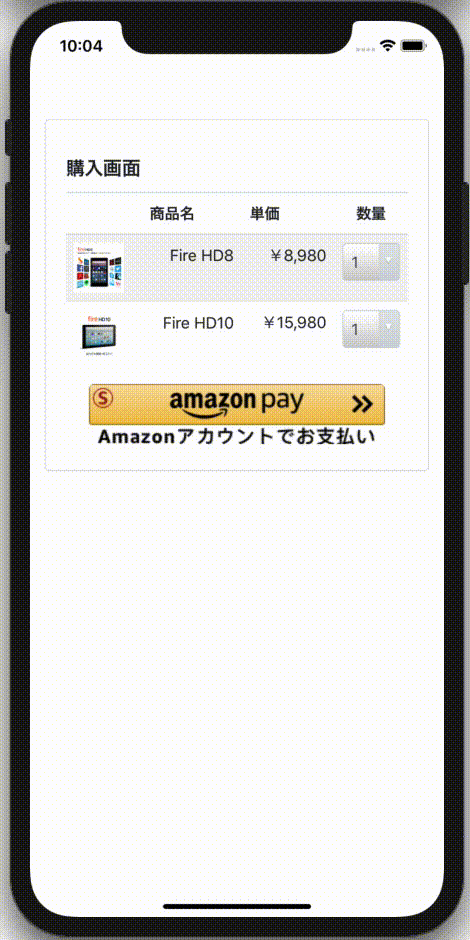
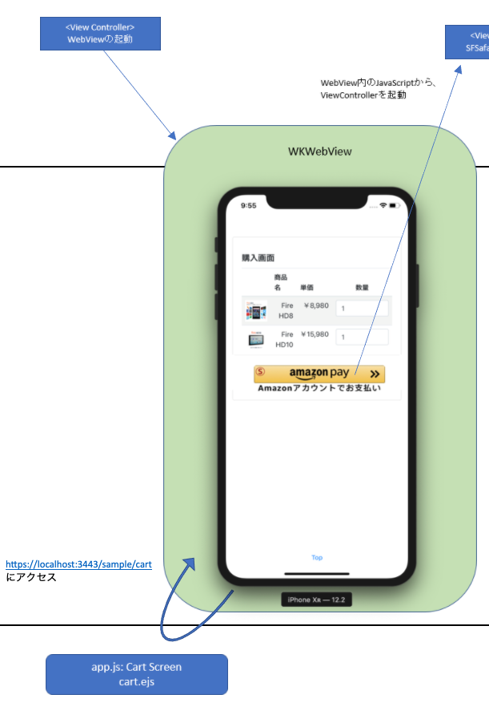
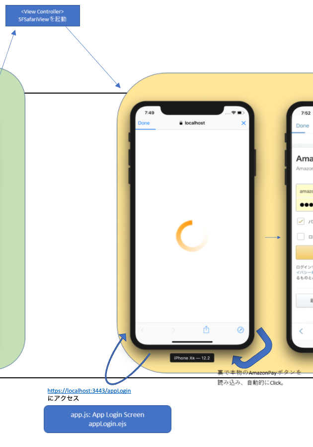
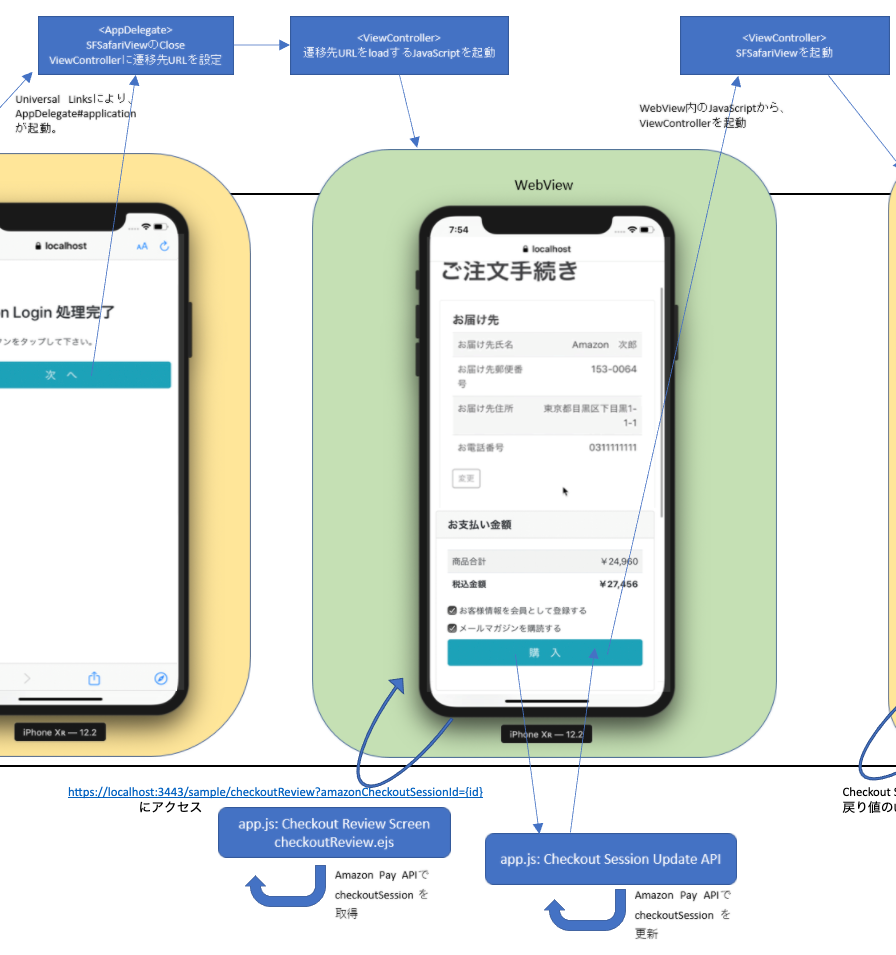
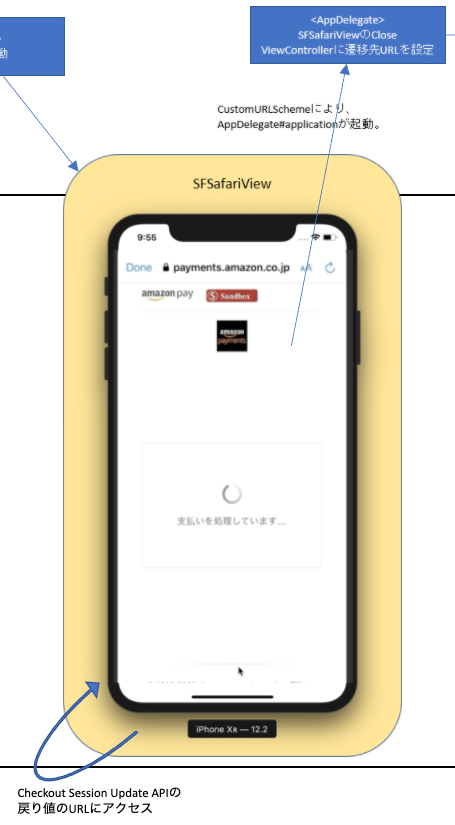
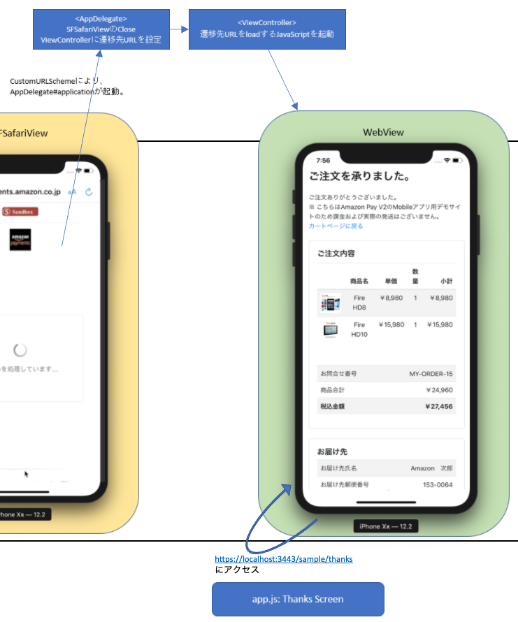
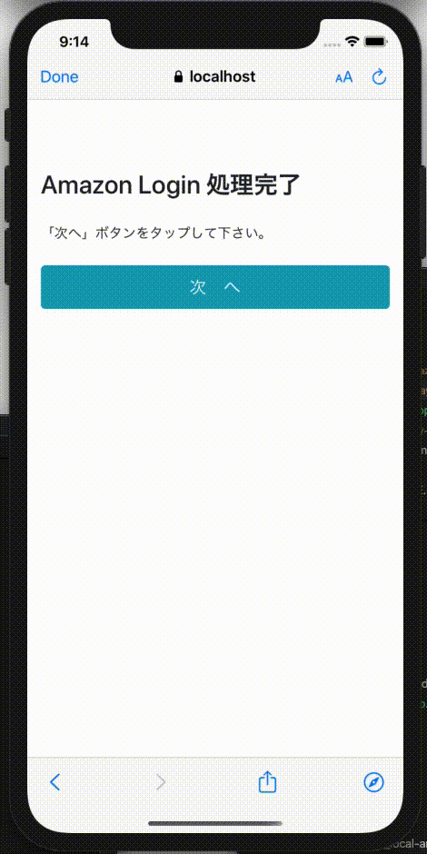
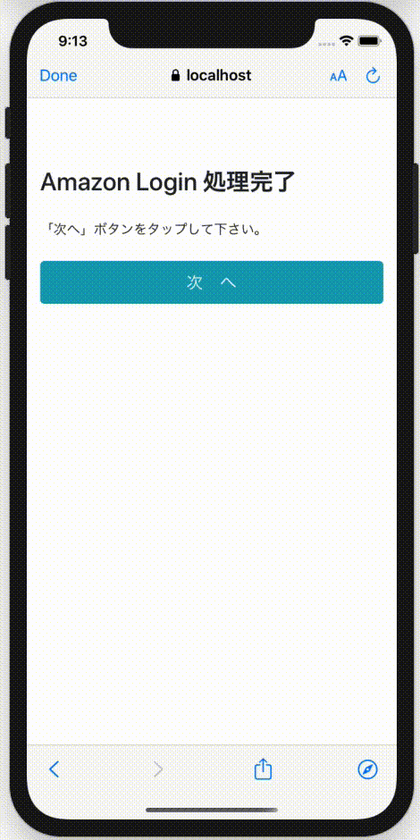

# Amazon Pay モバイル サンプルアプリ iOSアプリの実装について
本サンプルアプリの、iOSアプリ側の実装です。インストールして動作させる方法については、[こちら](./README_install.md)をご参照下さい。

# 動作環境
iOS バージョン11.2以降: Safari Mobile 11以降  
[参考] https://pay.amazon.com/jp/help/202030010

# その他の前提条件
本サンプルアプリではUniversal Linksという技術を使っており、こちらを利用するためには下記の条件が必要です。
 - [Apple Developer Program](https://developer.apple.com/jp/programs/)に登録していること 
 - Web上のhttpsで正しくアクセスできる場所に設定ファイルを配置する必要があるので、ECサイトとは別ドメインのサーバーか、AWS等のクラウドサービスのアカウントを保有していること  
   Note: 本サンプルアプリでは、[Amazon S3](https://aws.amazon.com/jp/s3/)を利用しています。こちらはアカウントをInternet上で簡単に取得でき、世界中で広く使われており、利用方法などの情報も多く、12ヶ月間 5GBの無料利用枠もあるため、お勧めです。  

# 概要
本サンプルアプリは、下記動画のように動作いたします。

  

フローの詳細は、[flow-ios.xlsx](./flow-ios.xlsx) をご参照ください。  
こちらのフローをベースに、以後詳細な実装方法について解説します。

# Amazon Payの実装方法 - WebViewアプリ編

## カートページ

  

### モバイルアプリのJavaScript側からのCallback受付の設定
モバイルアプリではAmazon Payの処理はSecure WebView上で実行する必要がありますが、WebViewから直接Secure WebViewは起動できないため、WebViewのJavaScriptから一旦Nativeコードを起動できるよう設定する必要があります。  
それを行うのが下記のコードです。  

```swift
// ViewController.swiftから抜粋 (見やすくするため、一部加工しています。)

            // JavaScript側からのCallback受付の設定
            let userContentController = WKUserContentController()
            userContentController.add(self, name: "iosApp")
            let webConfig = WKWebViewConfiguration();
            webConfig.userContentController = userContentController
            
            // WebViewの生成、cartページの読み込み
            webView = WKWebView(frame: rect, configuration: webConfig)
                :
                :
extension ViewController: WKScriptMessageHandler {
    // JavaScript側からのCallback.
    func userContentController(_ userContentController: WKUserContentController, didReceive message: WKScriptMessage) {
        print("ViewController#userContentController")
                :
    }
}
```

このように設定すると、下記のようにJavaScript側からNative側にメッセージを送信することが可能になります。
```js
        webkit.messageHandlers.iosApp.postMessage(data);
```

### クライアント判定
本サンプルアプリでは、同一のHTML/JavaScriptの画面でAndroid/iOS/通常のBrowserの全てに対応しております。  
そのため、動作環境に応じて処理を切り替える必要がある場合には、クライアントを判定して条件分岐を行う必要があります。  
それを行っているのが、下記のJavaScriptのコードです。

```js
// nodejs/views/sample/cart.ejsより抜粋

    let client = "browser";
    if(window.androidApp) {
        client = "androidApp";
    } else if(window.webkit && webkit.messageHandlers && webkit.messageHandlers.iosApp) {
        client = "iosApp";
    }
    document.cookie = "client=" + client + ";path=/;secure";
```

上記「モバイルアプリのJavaScript側からのCallback受付の設定」で設定されたCallback用のObjectの存在確認を行うことで、それぞれ何の環境なのかを判定しています。  
判定結果はServer側でも参照できるよう、Cookieに設定しています。  

### 「Amazon Payボタン」画像の配置

Amamzon Payで支払いができることをユーザに視覚的に伝えるのには、Amazon Payボタンを画面に表示するのが効果的です。  
WebView上では本物のAmazon Payボタンを配置できないので、ここでは画像を代わりに配置しています。

それを行っているのが、下記のJavaScriptです。
```js
// nodejs/views/sample/cart.ejsより抜粋 (見やすくするため、一部加工しています。)

    if(client === 'browser') {
        amazon.Pay.renderButton('#AmazonPayButton', {
            :
        });
    } else {
        let node = document.createElement("input");
        node.type = "image";
        node.src = "/static/img/button_images/Sandbox-live-ja_jp-amazonpay-gold-large-button_T2.png";
        node.addEventListener('click', (e) => {
            coverScreen();
            if(client === 'androidApp') {
                androidApp.login();
            } else {
                // → iOSの場合. 
                webkit.messageHandlers.iosApp.postMessage({op: 'login'});
            }
        });
        document.getElementById("AmazonPayButton").appendChild(node);
    }
```

最初の判定で、通常のBrowserだった場合にはそのままAmazon Payの処理が実施できるので、通常通りAmazon Payボタンを読み込んでいます。  
iOSの場合は、「Amazon Payボタン」画像のnodeを生成して同画面内の「AmazonPayButton」ノードの下に追加しています。  
この時指定する「Amazon Payボタン」画像は「./nodejs/static/img/button_images」の下にあるものから選ぶようにして下さい。なお、本番環境向けにファイル名が「Sandbox_」で始まるものを指定しないよう、ご注意下さい。  
また、この生成したnodeがclickされたとき、「login」を指定したObjectをパラメタとして、Native側のCallbackを呼び出すEvent Handlerをaddしています。  

### 「Amazon Payボタン」画像クリック時の、Secure WebViewの起動処理
上記、「Amazon Payボタン」画像がクリックされたときに呼び出されるNative側のコードが、下記になります。  

```swift
// ViewController.swiftから抜粋 (見やすくするため、一部加工しています。)

extension ViewController: WKScriptMessageHandler {
    // JavaScript側からのCallback.
    func userContentController(_ userContentController: WKUserContentController, didReceive message: WKScriptMessage) {
        print("ViewController#userContentController")
        switch message.name {
        case "iosApp":
            print("iosApp")
            
            if let data = message.body as? NSDictionary {
                let op = data["op"] as! String?
                switch op! {
                case "login":
                    invokeAppLoginPage() // ← 今回は「login」が指定されているので、こちらが起動する
                case "auth":
                    invokeAuthorizePage(data["url"] as! String)
                default:
                    return
                }
            }
        default:
            return
        }
    }
}
```

「invokeAppLoginPage()」の処理が、下記になります。  
```swift
// ViewController.swiftから抜粋 (見やすくするため、一部加工しています。)

    var token: String?
        :
    func invokeAppLoginPage() {
        print("ViewController#invokeButtonPage")
        
        token = UUID().uuidString.lowercased()
        let safariView = SFSafariViewController(url: NSURL(string: "https://localhost:3443/appLogin?client=iosApp&token=\(token!)")! as URL)
        present(safariView, animated: true, completion: nil)
    }
```

URLを指定して、SFSafariViewController(iOS側のSecure WebView)を起動しているのが分かると思います。  
なお、UUID(version 4)を生成して「token」という名前で、Native側のFieldとURLのパラメタとして設定していますが、こちらの理由については後述します。  

## 自動的にAmazonログイン画面に遷移させるページ

  

こちらの画面ではAmazon Payが用意した「initCheckout」というメソッドをJavaScriptでcallすることで、Amazonログイン画面に遷移させています。  

### Server側のAmazon Payボタン出力準備
Amazon Payボタンを出力するための準備として、Server側にてAmazon Payボタンの出力に必要なpayloadと signatureの生成、その他の設定値の受け渡しを行います。  

```js
// nodejs/app.jsより抜粋 (見やすくするため、一部加工しています。)

//-------------------
// App Login Screen
//-------------------

app.get('/appLogin', async (req, res) => {
    // ※ req.queryには、上記ViewControllerで指定されたURLパラメタが入る
    res.render('appLogin.ejs', calcConfigs(`https://amazon-pay-links-v2.s3-ap-northeast-1.amazonaws.com/redirector_local-${req.query.client}.html?token=${req.query.token}`));
});

function calcConfigs(url) {
    const payload = createPayload(url);
    const signature = apClient.generateButtonSignature(payload);
    return {payload: payload, signature: signature, merchantId: keyinfo.merchantId, publicKeyId: keyinfo.publicKeyId};
}

function createPayload(url) {
    return {
        webCheckoutDetails: {
            checkoutReviewReturnUrl: url
        },
        storeId: keyinfo.storeId
    };
}
```

指定されているURLの「https://amazon-pay-links-v2.s3-ap-northeast-1.amazonaws.com/...」 はAmazon Payへのログイン & 住所・支払い方法の選択後のリダイレクト先になります。  
このURLは後述の「Universal Links」という技術でSecure WebViewからNativeコードを起動するために使用されます。  

これらの値が「appLogin.ejs」にパラメタとして渡され、HTML & CSS & JavaScriptが生成されます。  

```html
<!-- nodejs/views/appLogin.ejsより抜粋 (見やすくするため、一部加工しています。) -->

    :
<script src="https://static-fe.payments-amazon.com/checkout.js"></script>
<script type="text/javascript" charset="utf-8">
    amazon.Pay.initCheckout({
        merchantId: '<%= merchantId %>',
        ledgerCurrency: 'JPY', // Amazon Pay account ledger currency
        sandbox: true, // dev environment
        checkoutLanguage: 'ja_JP', // render language
        productType: 'PayAndShip', // checkout type
        placement: 'Cart', // button placement
        createCheckoutSessionConfig: {
            payloadJSON: '<%- JSON.stringify(payload) %>', // string generated in step 2 (※ HTML Escapeをしないで出力する)
            signature: '<%= signature %>', // signature generated in step 3
            publicKeyId: '<%= publicKeyId %>' 
        }
    });    
</script>
```

この「initCheckout」メソッドの呼出により、自動的にAmazon Payのログイン画面に遷移させています。  
こちらのファイルは[EJS](https://ejs.co/)というTemplate Engineを使って作成されていますが、構文はTemplate Engineとしては一般的なものであるため、比較的簡単に理解できるかと思います。  

## Amazon側の画面からのリダイレクトによる、Universal Linksの発動

  

### Universal Linksについて
Universal Linksについての詳細については、[こちら](./README_swv2app.md)に記載しております。

Universal Linksの基本的な発動条件は「Safari/SFSafariView等でLinkをタップする」ことですが、iOSのバージョンやその他の条件によっては、ServerからのRedirectでも発動することがあります。  
Universal Linksが発動しなかった場合には、指定されたURLに存在するファイルが通常通りに表示されます。  

### 救済ページを使った2段構えのUniversal Linksの発動
本サンプルでは、Amazon側のページでログイン＆住所・支払い方法の選択をしたあとのリダイレクトでUniversal Linksが発動するURLを指定していますが、上記の理由により、ここでは発動しない場合もあり得ます。  

本サンプルではその場合の備えとして、発動しなかった場合には再度Universal Linksが発動するURLへのリンクを持つ、救済ページに自動的に遷移するように作られています。  
ここではその仕組を説明します。  

「自動的にAmazonログイン画面に遷移させるページ」で登場した、Universal Linksを発動させるURLのiOS版は、下記になります。  
https://amazon-pay-links-v2.s3-ap-northeast-1.amazonaws.com/redirector_local-iosApp.html?token=XXXXXXXX

上記でも書いたとおり、Universal Linksが発動しなかった場合には、指定されたURLに存在するファイルが表示されます。  
このURLの先には下記の内容のHTMLファイルが置かれております。  
```html
<!-- nodejs/linksの下にも同じものが置かれています。 -->

<html>
    <script>
        location.href = "https://localhost:3443/static/next.html" + location.search;
    </script>
</html>
```

こちらはファイルにアクセス時に指定されたURLパラメタを付与した上で、「next.html」にリダイレクトしています。  
Note: ↑はlocal環境用なのでリダイレクト先が「https://localhost:3443/static/next.html 」になっていますが、こちらは本番・各テスト等の環境に応じて変更する必要があります。  
「next.html」の中身が下記です。  
```html
<!-- nodejs/static/next.htmlより抜粋 -->

<body data-gr-c-s-loaded="true">
<div class="container">
    <h3 class="my-4">Amazon Login 処理完了</h3>
    「次へ」ボタンをタップして下さい。<br>
    <br>
    <a id="nextButton" href="#" class="btn btn-info btn-lg btn-block">
        次　へ
    </a>
</div>
<script>
    document.getElementById("nextButton").href = 
        "https://amazon-pay-links-v2.s3-ap-northeast-1.amazonaws.com/index.html" + location.search;
</script>
</body>
```

アクセス時に指定されたURLパラメタを付与したUniversal Linksを発動するURLを「id="nextButton"」のリンクに指定しております。  
この仕組みにより、Universal Linksが発動しなかった場合にはこちらの画面が表示されます。この「次へ」のLinkをユーザがタップすることで、確実に条件を満たしてUniversal Linksを発動させることができます。  

## 購入ページ

  

### tokenチェックとViewControllerへの遷移先URLの設定
Universal Linksにより起動されるNaiveコードは、下記になります。  

```swift
// AppDelegateより抜粋　(見やすくするため、一部加工しています。)

    func application(_ application: UIApplication, continue userActivity: NSUserActivity, restorationHandler: @escaping ([UIUserActivityRestoring]?) -> Void) -> Bool {
        print("Universal Links!")
        if userActivity.activityType == NSUserActivityTypeBrowsingWeb {
            print(userActivity.webpageURL!)
            
            // URLパラメタのパース
            var urlParams = Dictionary<String, String>.init()
            for param in userActivity.webpageURL!.query!.components(separatedBy: "&") {
                let kv = param.components(separatedBy: "=")
                urlParams[kv[0]] = kv[1].removingPercentEncoding
            }
            
            // 現在最前面のSFSafariViewとその裏のViewControllerを取得
            var sfsv = UIApplication.shared.keyWindow?.rootViewController
            var vc:ViewController? = nil
            while (sfsv!.presentedViewController) != nil {
                if let v = sfsv as? ViewController {
                    vc = v
                }
                sfsv = sfsv!.presentedViewController
            }
            
            if(vc?.token! == urlParams["token"]!) { // tokenの一致判定
                // 一致した場合には、購入ページのURLをViewControllerに設定
                vc?.webviewUrl = "/sample/checkoutReview?amazonCheckoutSessionId=\(urlParams["amazonCheckoutSessionId"]!)"
            } else {
                // 不一致の場合には不正な遷移であるため、エラーページを設定
                vc?.webviewUrl = "static/sample/error.html"
            }

            // SFSafariViewのclose (この後、ViewController#viewDidLoadに処理が移る)
            (sfsv as? SFSafariViewController)?.dismiss(animated: false, completion: nil)
        }
        return true
    }
```
まず、Universal Links発動のURLに指定されていたURLパラメタを取得します。  
次にApplicationの履歴階層から、この時点で最前面に表示されているSFSafariViewControllerと、そのすぐ下のViewControllerを取得します。  

その後、「『Amazon Payボタン』画像クリック時の、Secure WebViewの起動処理」でViewControllerに保持したtokenと、Secure WebViewから受け渡されたtokenの一致判定を行っています。  
このtokenの判定を行うことで、不正な遷移でこの処理が起動された場合に、それを検出してエラーとできるようになります。  

例えば、悪いユーザがSecure WebViewを起動する時の「自動的にAmazonログイン画面に遷移させるページ」へのURLを読み取って、メールなどで他のユーザに送ったとします。  
送りつけられたユーザがiOS端末でメールのURLのリンクをクリックした場合、Safariが立ち上がってAmazon Payログインページに遷移してしまう可能性があります。  
もしそのままAmazon Payにログインして、住所・支払い方法選択も実施した場合、SafariならUniversal Linksも発動してしまいますので、同アプリをインストールしていればその後の購入フローも実行できることになってしまいます。  
画面のFlowによってはこれが大きな問題になる可能性もあるため、本サンプルアプリでは念のためにtokenチェックを行っております。  

tokenチェックの後は、購入ページのURLをViewControllerに設定します。  
購入ページのURLには「amazonCheckoutSessionId」をURLパラメタを付与しますが、これはPC・Mobileのブラウザでの購入ページへの遷移と全く同じURL・全く同じ条件になります。  
よって、この後の購入ページの表示では「モバイルアプリ向け」「PC・Mobileのブラウザ向け」で別々の処理を実装する必要はありません。  

最後に、SFSafariView(Secure WebView)をcloseします。これにより、すぐ下のViewController#viewDidLoadに処理が移ります。  

### 購入ページの読み込み

ViewControllerでは、viewDidLoadの中の下記の処理が起動します。  

```swift
// ViewControllerより抜粋　(見やすくするため、一部加工しています。)

                    :
            let url = webviewUrl
            if(url != nil) {
                webviewUrl = nil
                webView.evaluateJavaScript("loadUrl('\(url!)')", completionHandler: nil)
                    :
```

WebViewではこの時点でカートページが表示されており、上記にて下記のJavaScriptが起動して購入ページの読み込みが開始します。  

```js
    function loadUrl(url) {
        location.href = url;
    }
```

Server側では下記が実行されます。

```js
// nodejs/app.jsより抜粋 (見やすくするため、一部加工しています。)

//-------------------------
// Checkout Review Screen
//-------------------------
app.get('/sample/checkoutReview', async (req, res) => {
    // 受注情報
    let order = {host: req.headers.host, amazonCheckoutSessionId: req.query.amazonCheckoutSessionId,
        client: req.cookies.client, hd8: req.cookies.hd8, hd10: req.cookies.hd10, items: []};
    order.items.push({id: 'item0008', name: 'Fire HD8', price: 8980, num: parseInt(order.hd8)});
    order.items.push({id: 'item0010', name: 'Fire HD10', price: 15980, num: parseInt(order.hd10)});
    order.items.forEach(item => item.summary = item.price * item.num); // 小計
    order.price = order.items.map(item => item.summary).reduce((pre, cur) => pre + cur); // 合計金額
    order.chargeAmount = Math.floor(order.price * 1.1); // 税込金額

    // Amazon Pay受注情報
    const payload = await apClient.getCheckoutSession(req.query.amazonCheckoutSessionId, 
        {'x-amz-pay-idempotency-key': uuid.v4().toString().replace(/-/g, '')});
    order.checkoutSession = JSON.parse(payload.body);

    // Note: 一般的には受注情報はSessionやDBなどを使ってServer側に保持しますが、本サンプルではシンプルにするためにCookieを使用しています
    res.cookie('session', JSON.stringify(order), {secure: true});
    
    res.render('sample/checkoutReview.ejs', order);
});
```

cartの情報を計算して金額を出し、またAmazon Pay APIより住所情報等を取得し、template engineに渡して画面を生成して表示します。

### 購入ボタンクリック時の処理

購入ボタンをクリックすると、下記のScriptが実行されます。

```js
// nodejs/views/sample/checkoutReview.ejsより抜粋 (見やすくするため、一部加工しています。)

            :
    document.getElementById("purchaseButton").addEventListener('click', (e) => {
        $.ajax({
            type: 'POST',
            url: '/sample/checkoutSession',
            data: {},
        })
        .then(
            :
```

Ajaxにより、下記のServer側のCheckout Session Update APIが呼び出されます。  

```js
// nodejs/app.jsより抜粋 (見やすくするため、一部加工しています。)

//-----------------------------
// Checkout Session Update API
//-----------------------------

// 事業者側の受注番号の採番
const newMerchantReferenceId = function() {
    let currentNumber = 1;
    return function() {
        return "MY-ORDER-" + currentNumber++;
    }
} ();

app.post('/sample/checkoutSession', async (req, res) => {
    let order = JSON.parse(req.cookies.session);
    const payload = await updateCheckoutSession({merchantReferenceId: newMerchantReferenceId(),
        merchantStoreName: "MY-SHOP", noteToBuyer: "Thank you!", customInformation: "This isn't shared with Buyer", ...order});    
    order.checkoutSession = JSON.parse(payload.body);

    // Note: 一般的には受注情報はSessionやDBなどを使ってServer側に保持しますが、本サンプルではシンプルにするためにCookieを使用しています
    res.cookie('session', JSON.stringify(order), {secure: true});

    res.writeHead(200, {'Content-Type': 'application/json; charset=UTF-8'});
    res.write(payload.body);
    res.end()
});

async function updateCheckoutSession(data) {
    const url = data.client === 'browser' ? "https://localhost:3443/sample/thanks" :
        `https://${data.host}/static/dispatcher.html?client=${data.client}`;
    return await apClient.updateCheckoutSession(data.amazonCheckoutSessionId, {
        webCheckoutDetails: {
            checkoutResultReturnUrl: url
        },
        paymentDetails: {
            paymentIntent: 'Authorize',
            canHandlePendingAuthorization: false,
            chargeAmount: {
                amount: '' + data.chargeAmount,
                currencyCode: "JPY"
            }
        },
        merchantMetadata: {
            merchantReferenceId: data.merchantReferenceId,
            merchantStoreName: data.merchantStoreName,
            noteToBuyer: data.noteToBuyer,
            customInformation: data.customInformation
        }
    }, {
        'x-amz-pay-idempotency-key': uuid.v4().toString().replace(/-/g, '')
    });
}
```

Amazon PayのAPIを使って、決済に必要な購入金額や事業者側の受注番号等の情報と、支払い処理ページ(後述)で自動的にリダイレクトされるURLを指定して、checkoutSessionに対してupdateしています。  
この、「支払い処理ページで自動的にリダイレクトされるURL」ですが、Browserの場合は直接ThanksページのURLを、iOS及びAndroidの場合は中継用ページ(後述)へのURLを、それぞれ指定します。
Amazon PayのAPIからの戻り値は、そのままCheckout Session Update APIのResponseとして返却します。  

AjaxのResponseが返ってくると、下記が実行されます。

```js
// nodejs/views/sample/checkoutReview.ejsより抜粋 (見やすくするため、一部加工しています。)

            :
    document.getElementById("purchaseButton").addEventListener('click', (e) => {
        $.ajax({
            :
        })
        .then(
            function(json) { //success
                if(json.webCheckoutDetails.amazonPayRedirectUrl) {
                    if(window.androidApp) {
                        coverScreen();
                        androidApp.auth(json.webCheckoutDetails.amazonPayRedirectUrl);
                    } else if(window.webkit && webkit.messageHandlers && webkit.messageHandlers.iosApp) {
                        // iOSの場合
                        coverScreen();
                        webkit.messageHandlers.iosApp.postMessage({op: 'auth', url: json.webCheckoutDetails.amazonPayRedirectUrl});            
                    } else {
                        window.location.href = json.webCheckoutDetails.amazonPayRedirectUrl;
                    }
                } else {
                    location.href = "/static/sample/error.html";
                }
            },
            function() { //failure
                console.log("error");
                location.href = "/static/sample/error.html";
            }
        );
    });
```

WebViewに渡されたCallback Objectの存在チェックにより、クライアントの環境を判定して対応する処理を実行します。  
今回はiOSなので、下記が実行されます。
```js
                        webkit.messageHandlers.iosApp.postMessage({op: 'auth', url: json.webCheckoutDetails.amazonPayRedirectUrl});
```

これにより、文字列「auth」とCheckout Session Update APIのResponseに含まれていたURLをパラメタとして、Native側の下記の処理が実行されます。  

```swift
// ViewController.swift より抜粋

    // JavaScript側からのCallback.
    func userContentController(_ userContentController: WKUserContentController, didReceive message: WKScriptMessage) {
        print("ViewController#userContentController")
        switch message.name {
        case "iosApp":
            print("iosApp")
            
            if let data = message.body as? NSDictionary {
                let op = data["op"] as! String?
                switch op! {
                case "login":
                    invokeAppLoginPage()
                case "auth":
                    invokeAuthorizePage(data["url"] as! String) // ← ここが実行される
                default:
                    return
                }
            }
        default:
            return
        }
    }
```

「invokeAuthorizePage」は下記です。

```swift
    func invokeAuthorizePage(_ url: String) {
        print("ViewController#invokeAuthorizePage")
        let safariView = SFSafariViewController(url: NSURL(string: url)! as URL)
        present(safariView, animated: true, completion: nil)
    }
```

以上により、Amazon Pay APIのcheckoutSession更新処理の戻り値に含まれていたURLを、Secure WebViewで開くことができます。  

## 支払い処理ページ

  

上記Amazon Pay APIより渡されたURLに対してアクセスすると、支払い処理ページ(スピナーページとも呼ばれます)が表示されます。  
この画面が表示されている間、Amazon側ではServer側で与信を含む支払いの処理が行われており、エラーハンドリングも含めてこちらの画面で処理されています。  
支払いの処理が終わると、「購入ボタンクリック時の処理」で指定した中継用ページへのURLに自動的にリダイレクトされます。  

### 中継用ページ
中継用ページは下記のようになっています。  

```html
<!-- nodejs/static/dispatcher.html より抜粋 -->
    :
<script type="text/javascript" charset="utf-8">
    function getURLParameter(name, source) {
        return decodeURIComponent((new RegExp('[?|&amp;|#]' + name + '=' +
                        '([^&;]+?)(&|#|;|$)').exec(source) || [, ""])[1].replace(/\+/g, '%20')) || null;
    }

    const client = getURLParameter("client", location.search);
    location.href = client === 'iosApp' 
        ? 'amazonpay-ios-v2://thanks'
        : 'intent://amazon_pay_android_v2#Intent;package=com.amazon.pay.sample.android_app_v2;scheme=amazon_pay_android_v2;end;';
</script>

<body></body>
</html>
```

ここではCustomURLSchemeを使って、JavaScriptよりアプリを起動しています。  
CustomURLSchemeについての詳細については、[こちら](./README_swv2app.md)をご参照下さい。  
Universal Linksとは違い、CustomURLSchemeでは間違って悪意のあるアプリが起動してしまう可能性がゼロではないため、ここでは「amazonCheckoutSessionId」のようなセンシティブな情報は渡さないようにします。  

## Thanksページ

  

### CustomURLSchemeにより起動されるNativeの処理

上記CustomURLSchemeにより起動されるNativeの処理は、下記になります。

```swift
// AppDelegate.swift より抜粋

    func application(_ app: UIApplication, open url: URL, options: [UIApplication.OpenURLOptionsKey : Any] = [:]) -> Bool {
        print("Custom URL Scheme!")
        
        var sfsv = UIApplication.shared.keyWindow?.rootViewController
        var vc:ViewController? = nil
        
        // 現在最前面のSFSafariViewとその裏のViewControllerを取得
        while (sfsv!.presentedViewController) != nil {
            if let v = sfsv as? ViewController {
                vc = v
            }
            sfsv = sfsv!.presentedViewController
        }
        
        // ThanksページのURLをViewControllerに設定
        vc?.webviewUrl = "/sample/thanks"
        
        // SFSafariViewのclose (この後、ViewController#viewDidLoadに処理が移る)
        (sfsv as? SFSafariViewController)?.dismiss(animated: false, completion: nil)
        
        return true
    }
```

Applicationの履歴階層から、この時点で最前面に表示されているSFSafariViewControllerと、そのすぐ下のViewControllerを取得します。  
次にThanksページのURLをViewControllerに設定します。  
最後に、SFSafariView(Secure WebView)をcloseします。これにより、すぐ下のViewController#viewDidLoadに処理が移ります。  

### Thanksページの読み込み

ViewControllerでは、viewDidLoadの中の下記の処理が起動します。  

```swift
// ViewControllerより抜粋　(見やすくするため、一部加工しています。)

                    :
            let url = webviewUrl
            if(url != nil) {
                webviewUrl = nil
                webView.evaluateJavaScript("loadUrl('\(url!)')", completionHandler: nil)
                    :
```

WebViewではこの時点で購入ページが表示されており、上記にて下記のJavaScriptが起動してThanksページの読み込みが開始します。  

```js
    function loadUrl(url) {
        location.href = url;
    }
```

Server側では下記が実行されます。

```js
// nodejs/app.jsより抜粋 (見やすくするため、一部加工しています。)

//-------------------
// Thanks Screen
//-------------------
app.get('/sample/thanks', async (req, res) => {
    const order = JSON.parse(req.cookies.session);
    await apClient.completeCheckoutSession(order.amazonCheckoutSessionId, {
        chargeAmount: {
            amount: '' + order.chargeAmount,
            currencyCode: "JPY"
        }
    });
    res.render('sample/thanks.ejs', order);
});
```

Amazon Pay APIを使ってcheckoutSessionを完了し、thanks画面を表示しています。  
本サンプルアプリの一連の流れとしては、以上となります。

## その他

### Secure WebView起動時の対処
WebViewからSecure WebView起動処理をJavaScriptで呼び出すとき、下記のように直前で「coverScreen」という、画面を真っ白にする関数を呼んでいます。  

```html
<!-- nodejs/views/sample/cart.ejsより抜粋　(見やすくするため、一部加工しています。) -->
                :
<body data-gr-c-s-loaded="true">
<div id="white_cover" style="width:100%; height:100vh; background-color:#fff; position:relative; z-index:1000; display:none;"></div>
                :
<script type="text/javascript" charset="utf-8">
                :
        node.addEventListener('click', (e) => {
            coverScreen(); // ← ここで呼んでいる
            if(client === 'androidApp') {
                androidApp.login();
            } else {
                webkit.messageHandlers.iosApp.postMessage({op: 'login'}); // ← Secure WebView起動処理
            }
        });
                :
    function coverScreen() {
        document.getElementById('white_cover').style.display = 'block';
    }

    function uncoverScreen() {
        document.getElementById('white_cover').style.display = 'none';
    }
</script>
                :
```

もしこの関数を呼ばなかった場合、Secure WebViewがCloseされるときの画面は、下記のような動きになります。  
  
WebViewの画面の遷移が終わるまでの間、Secure WebView起動前の画面が表示されるため、不自然に見えてしまいます。  

Secure WebView起動直前に「coverScreen」を呼び出しておくことで、下記のように自然な見え方にすることができます。  
  

なおこのままだと、ユーザがSecure WebViewの左上の「Done」をタップしてWebViewに戻ってきた場合には、画面が真っ白なままになってしまいます。  
そこでその場合には、ViewController#viewDidLoadの下記コードにて「uncoverScreen」を呼んで、白い画面を元に戻しています
。   

```swift
// ViewControllerより抜粋
                webView.evaluateJavaScript("if(window.uncoverScreen) {uncoverScreen();}", completionHandler: nil)
```

本サンプルでは「coverScreen」は単に真っ白な画面を表示していますが、こちらは各モバイルアプリのデザインや方針などに応じて、より自然に見えるものを表示することをお勧めいたします。  


# Amazon Payの実装方法 - Nativeアプリ編

## カートページ or 商品ページ
  

### 「Amazon Payボタン」画像の配置

Amamzon Payで支払いができることをユーザに視覚的に伝えるのには、Amazon Payボタンを画面に表示するのが効果的です。  
Nativeアプリでは本物のAmazon Payボタンを配置できないので、画像を代わりに配置します。

この時指定する「Amazon Payボタン」画像は「./nodejs/static/img/button_images」の下にあるものから選ぶようにして下さい。なお、本番環境向けにファイル名が「Sandbox_」で始まるものを指定しないよう、ご注意下さい。  

### 「Amazon Payボタン」画像クリック時の、Secure WebViewの起動処理
上記、「Amazon Payボタン」画像がクリックされたときには、下記のようなコードを呼びます。  
```swift
// ViewController.swiftから抜粋 (見やすくするため、一部加工しています。)

    var token: String?
        :
    func invokeAppLoginPage() {
        print("ViewController#invokeButtonPage")
        
        token = UUID().uuidString.lowercased()
        let safariView = SFSafariViewController(url: NSURL(string: "https://localhost:3443/appLogin?client=iosApp&token=\(token!)")! as URL)
        present(safariView, animated: true, completion: nil)
    }
```

URLを指定して、SFSafariViewController(iOS側のSecure WebView)を起動しているのが分かると思います。  
なお、UUID(version 4)を生成して「token」という名前で、Native側のFieldとURLのパラメタとして設定していますが、こちらの理由については後述します。  

## 自動的にAmazonログイン画面に遷移させるページ

  

こちらの画面ではAmazon Payボタンを裏で出力し、こちらを自動的にJavaScriptでClickすることで、Amazonログイン画面に遷移させています。  

### Server側のAmazon Payボタン出力準備
Amazon Payボタンを出力するための準備として、Server側にてAmazon Payボタンの出力に必要なpayloadと signatureの生成、その他の設定値の受け渡しを行います。  

```js
// nodejs/app.jsより抜粋 (見やすくするため、一部加工しています。)

//-------------------
// App Login Screen
//-------------------

app.get('/appLogin', async (req, res) => {
    // ※ req.queryには、上記ViewControllerで指定されたURLパラメタが入る
    res.render('appLogin.ejs', calcConfigs(`https://amazon-pay-links-v2.s3-ap-northeast-1.amazonaws.com/redirector_local-${req.query.client}.html?token=${req.query.token}`));
});

function calcConfigs(url) {
    const payload = createPayload(url);
    const signature = apClient.generateButtonSignature(payload);
    return {payload: payload, signature: signature, merchantId: keyinfo.merchantId, publicKeyId: keyinfo.publicKeyId};
}

function createPayload(url) {
    return {
        webCheckoutDetails: {
            checkoutReviewReturnUrl: url
        },
        storeId: keyinfo.storeId
    };
}
```

指定されているURLの「https://amazon-pay-links-v2.s3-ap-northeast-1.amazonaws.com/...」 はAmazon Payへのログイン & 住所・支払い方法の選択後のリダイレクト先になります。  
このURLは後述の「Universal Links」という技術でSecure WebViewからアプリを起動するために使用されます。  

これらの値が「appLogin.ejs」にパラメタとして渡され、HTML & CSS & JavaScriptが生成されます。  

```html
<!-- nodejs/views/appLogin.ejsより抜粋 (見やすくするため、一部加工しています。) -->

    :
<div class="hidden">
    <div id="AmazonPayButton"></div>
</div>

<script src="https://static-fe.payments-amazon.com/checkout.js"></script>
<script type="text/javascript" charset="utf-8">
    amazon.Pay.renderButton('#AmazonPayButton', {
        merchantId: '<%= merchantId %>',
        ledgerCurrency: 'JPY', // Amazon Pay account ledger currency
        sandbox: true, // dev environment
        checkoutLanguage: 'ja_JP', // render language
        productType: 'PayAndShip', // checkout type
        placement: 'Cart', // button placement
        buttonColor: 'Gold',
        createCheckoutSessionConfig: {
            payloadJSON: '<%- JSON.stringify(payload) %>', // string generated in step 2 (※ HTML Escapeをしないで出力する)
            signature: '<%= signature %>', // signature generated in step 3
            publicKeyId: '<%= publicKeyId %>' 
        }
    });

    setTimeout(() => {
        document.getElementById("AmazonPayButton").click();
    }, 0);
</script>
```

上記のようにAmazon Payボタンを生成してJavaScriptでclickさせることで、自動的にAmazon Payのログイン画面に遷移させています。  
こちらのファイルは[EJS](https://ejs.co/)というTemplate Engineを使って作成されていますが、構文はTemplate Engineとしては一般的なものであるため、比較的簡単に理解できるかと思います。

## Amazon側の画面からのリダイレクトによる、Universal Linksの発動

  

### Universal Linksについて
Universal Linksについての詳細については、[こちら](./README_swv2app.md)に記載しております。

Universal Linksの基本的な発動条件は「Safari/SFSafariView等でLinkをタップする」ことですが、iOSのバージョンやその他の条件によっては、ServerからのRedirectでも発動することがあります。  
Universal Linksが発動しなかった場合には、指定されたURLに存在するファイルが通常通りに表示されます。  

### 救済ページを使った2段構えのUniversal Linksの発動
本サンプルでは、Amazon側のページでログイン＆住所・支払い方法の選択をしたあとのリダイレクトでUniversal Linksが発動するURLを指定していますが、上記の理由により、ここでは発動しない場合もあり得ます。  

本サンプルではその場合の備えとして、発動しなかった場合には再度Universal Linksが発動するURLへのリンクを持つ、救済ページに自動的に遷移するように作られています。  
ここではその仕組を説明します。  

「自動的にAmazonログイン画面に遷移させるページ」で登場した、Universal Linksを発動させるURLのiOS版は、下記になります。  
https://amazon-pay-links-v2.s3-ap-northeast-1.amazonaws.com/redirector_local-iosApp.html?token=XXXXXXXX

上記でも書いたとおり、Universal Linksが発動しなかった場合には、指定されたURLに存在するファイルが表示されます。  
このURLの先には下記の内容のHTMLファイルが置かれております。  
```html
<!-- nodejs/linksの下にも同じものが置かれています。 -->

<html>
    <script>
        location.href = "https://localhost:3443/static/next.html" + location.search;
    </script>
</html>
```

こちらはファイルにアクセス時に指定されたURLパラメタを付与した上で、「next.html」にリダイレクトしています。  
Note: ↑はlocal環境用なのでリダイレクト先が「https://localhost:3443/static/next.html 」になっていますが、こちらは本番・各テスト等の環境に応じて変更する必要があります。  
「next.html」の中身が下記です。  
```html
<!-- nodejs/static/next.htmlより抜粋 -->

<body data-gr-c-s-loaded="true">
<div class="container">
    <h3 class="my-4">Amazon Login 処理完了</h3>
    「次へ」ボタンをタップして下さい。<br>
    <br>
    <a id="nextButton" href="#" class="btn btn-info btn-lg btn-block">
        次　へ
    </a>
</div>
<script>
    document.getElementById("nextButton").href = 
        "https://amazon-pay-links-v2.s3-ap-northeast-1.amazonaws.com/index.html" + location.search;
</script>
</body>
```

アクセス時に指定されたURLパラメタを付与したUniversal Linksを発動するURLを「id="nextButton"」のリンクに指定しております。  
この仕組みにより、Universal Linksが発動しなかった場合にはこちらの画面が表示されます。この「次へ」のLinkをユーザがタップすることで、確実に条件を満たしてUniversal Linksを発動させることができます。  

## 購入ページ

  

### tokenチェックとViewControllerへの遷移先URLの設定
Universal Linksにより起動される処理は、下記になります。  

```swift
// AppDelegateより抜粋　(見やすくするため、一部加工しています。)

    func application(_ application: UIApplication, continue userActivity: NSUserActivity, restorationHandler: @escaping ([UIUserActivityRestoring]?) -> Void) -> Bool {
        print("Universal Links!")
        if userActivity.activityType == NSUserActivityTypeBrowsingWeb {
            print(userActivity.webpageURL!)
            
            // URLパラメタのパース
            var urlParams = Dictionary<String, String>.init()
            for param in userActivity.webpageURL!.query!.components(separatedBy: "&") {
                let kv = param.components(separatedBy: "=")
                urlParams[kv[0]] = kv[1].removingPercentEncoding
            }
            
            // 現在最前面のSFSafariViewとその裏のViewControllerを取得
            var sfsv = UIApplication.shared.keyWindow?.rootViewController
            var vc:ViewController? = nil
            while (sfsv!.presentedViewController) != nil {
                if let v = sfsv as? ViewController {
                    vc = v
                }
                sfsv = sfsv!.presentedViewController
            }
            
            // SFSafariViewのclose (この後、ViewController#viewDidLoadに処理が移る)
            (sfsv as? SFSafariViewController)?.dismiss(animated: false, completion: nil)

            if(vc?.token! == urlParams["token"]!) { // tokenの一致判定
                // 一致した場合には、購入ページを構築して表示
            } else {
                // 不一致の場合には不正な遷移であるため、エラー処理
            }
        }
        return true
    }
```
まず、Universal Links発動のURLに指定されていたURLパラメタを取得します。  
次にApplicationの履歴階層から、この時点で最前面に表示されているSFSafariViewControllerと、そのすぐ下のViewControllerを取得します。  
そして、SFSafariView(Secure WebView)をcloseします。  

その後、「『Amazon Payボタン』画像クリック時の、Secure WebViewの起動処理」でViewControllerに保持したtokenと、Secure WebViewから受け渡されたtokenの一致判定を行っています。  
このtokenの判定を行うことで、不正な遷移でこの処理が起動された場合に、それを検出してエラーとできるようになります。  

例えば、悪いユーザがSecure WebViewを起動する時の「自動的にAmazonログイン画面に遷移させるページ」へのURLを読み取って、メールなどで他のユーザに送ったとします。  
送りつけられたユーザがiOS端末でメールのURLのリンクをクリックした場合、Safariが立ち上がってAmazon Payログインページに遷移してしまう可能性があります。  
もしそのままAmazon Payにログインして、住所・支払い方法選択も実施した場合、SafariならUniversal Linksも発動してしまいますので、同アプリをインストールしていればその後の購入フローも実行できることになってしまいます。  
画面のFlowによってはこれが大きな問題になる可能性もあるため、本サンプルアプリでは念のためにtokenチェックを行っております。  

tokenチェックにて問題がなかった場合には、購入ページを構築して表示します。  
購入ページには配送先や金額などの情報が必要であるため、Server側の下記のような処理を呼び出してこれらを取得する必要があります。

```js
// nodejs/app.jsより抜粋 (見やすくするため、一部加工しています。)

//-------------------------
// Checkout Review Screen
//-------------------------
app.get('/sample/checkoutReview', async (req, res) => {
    // 受注情報
    let order = {host: req.headers.host, amazonCheckoutSessionId: req.query.amazonCheckoutSessionId,
        client: req.cookies.client, hd8: req.cookies.hd8, hd10: req.cookies.hd10, items: []};
    order.items.push({id: 'item0008', name: 'Fire HD8', price: 8980, num: parseInt(order.hd8)});
    order.items.push({id: 'item0010', name: 'Fire HD10', price: 15980, num: parseInt(order.hd10)});
    order.items.forEach(item => item.summary = item.price * item.num); // 小計
    order.price = order.items.map(item => item.summary).reduce((pre, cur) => pre + cur); // 合計金額
    order.chargeAmount = Math.floor(order.price * 1.1); // 税込金額

    // Amazon Pay受注情報
    const payload = await apClient.getCheckoutSession(req.query.amazonCheckoutSessionId, 
        {'x-amz-pay-idempotency-key': uuid.v4().toString().replace(/-/g, '')});
    order.checkoutSession = JSON.parse(payload.body);

    // Note: 一般的には受注情報はSessionやDBなどを使ってServer側に保持しますが、本サンプルではシンプルにするためにCookieを使用しています
    res.cookie('session', JSON.stringify(order), {secure: true});
    
    // TODO ↓の部分はJSONなど、アプリで受け取りやすい形式のデータを返却するよう、修正する。
    // res.render('sample/checkoutReview.ejs', order);
});
```

cartの情報を計算して金額を出し、またAmazon Pay APIより住所情報等を取得し、返却します。

### 購入ボタンクリック時の処理

購入ボタンのクリック時には、下記のようにServer側のCheckout Session Update APIが呼び出して、決済に必要な購入金額や事業者側の受注番号等の情報と、支払い処理ページ(後述)で自動的にリダイレクトされるURLを指定して、checkoutSessionに対してupdateする必要があります。

```js
// nodejs/app.jsより抜粋 (見やすくするため、一部加工しています。)

//-----------------------------
// Checkout Session Update API
//-----------------------------

// 事業者側の受注番号の採番
const newMerchantReferenceId = function() {
    let currentNumber = 1;
    return function() {
        return "MY-ORDER-" + currentNumber++;
    }
} ();

app.post('/sample/checkoutSession', async (req, res) => {
    let order = JSON.parse(req.cookies.session);
    const payload = await updateCheckoutSession({merchantReferenceId: newMerchantReferenceId(),
        merchantStoreName: "MY-SHOP", noteToBuyer: "Thank you!", customInformation: "This isn't shared with Buyer", ...order});    
    order.checkoutSession = JSON.parse(payload.body);

    // Note: 一般的には受注情報はSessionやDBなどを使ってServer側に保持しますが、本サンプルではシンプルにするためにCookieを使用しています
    res.cookie('session', JSON.stringify(order), {secure: true});

    res.writeHead(200, {'Content-Type': 'application/json; charset=UTF-8'});
    res.write(payload.body);
    res.end()
});

async function updateCheckoutSession(data) {
    const url = data.client === 'browser' ? "https://localhost:3443/sample/thanks" :
        `https://${data.host}/static/dispatcher.html?client=${data.client}`;
    return await apClient.updateCheckoutSession(data.amazonCheckoutSessionId, {
        webCheckoutDetails: {
            checkoutResultReturnUrl: url
        },
        paymentDetails: {
            paymentIntent: 'Authorize',
            canHandlePendingAuthorization: false,
            chargeAmount: {
                amount: '' + data.chargeAmount,
                currencyCode: "JPY"
            }
        },
        merchantMetadata: {
            merchantReferenceId: data.merchantReferenceId,
            merchantStoreName: data.merchantStoreName,
            noteToBuyer: data.noteToBuyer,
            customInformation: data.customInformation
        }
    }, {
        'x-amz-pay-idempotency-key': uuid.v4().toString().replace(/-/g, '')
    });
}
```

この、「支払い処理ページで自動的にリダイレクトされるURL」ですが、モバイルアプリではNativeコードを起動させる必要があるため、中継用ページ(後述)へのURLを指定します。  
Amazon PayのAPIからの戻り値は、本サンプルアプリではそのままCheckout Session Update APIのResponseとして返却しています。  
リダイレクトする必要があるURLは下記になります。
```
$.webCheckoutDetails.amazonPayRedirectUrl
```

Nativeアプリ側でこのResponseを受け取ったら、上記のURLをパラメタとして下記の処理を実行します。  

```swift
    func invokeAuthorizePage(_ url: String) {
        print("ViewController#invokeAuthorizePage")
        let safariView = SFSafariViewController(url: NSURL(string: url)! as URL)
        present(safariView, animated: true, completion: nil)
    }
```

以上により、Amazon Pay APIのcheckoutSession更新処理の戻り値に含まれていたURLを、Secure WebViewで開くことができます。  

## 支払い処理ページ

  

上記Amazon Pay APIより渡されたURLに対してアクセスすると、支払い処理ページ(スピナーページとも呼ばれます)が表示されます。  
この画面が表示されている間、Amazon側ではServer側で与信を含む支払いの処理が行われており、エラーハンドリングも含めてこちらの画面で処理されています。  
支払いの処理が終わると、「購入ボタンクリック時の処理」で指定した中継用ページへのURLに自動的にリダイレクトされます。  

### 中継用ページ
中継用ページは下記のようになっています。  

```html
<!-- nodejs/static/dispatcher.html より抜粋 -->
    :
<script type="text/javascript" charset="utf-8">
    function getURLParameter(name, source) {
        return decodeURIComponent((new RegExp('[?|&amp;|#]' + name + '=' +
                        '([^&;]+?)(&|#|;|$)').exec(source) || [, ""])[1].replace(/\+/g, '%20')) || null;
    }

    const client = getURLParameter("client", location.search);
    location.href = client === 'iosApp' 
        ? 'amazonpay-ios-v2://thanks'
        : 'intent://amazon_pay_android_v2#Intent;package=com.amazon.pay.sample.android_app_v2;scheme=amazon_pay_android_v2;end;';
</script>

<body></body>
</html>
```

ここではCustomURLSchemeを使って、JavaScriptよりアプリを起動しています。  
CustomURLSchemeについての詳細については、[こちら](./README_swv2app.md)をご参照下さい。  
Universal Linksとは違い、CustomURLSchemeでは間違って悪意のあるアプリが起動してしまう可能性がゼロではないため、ここでは「amazonCheckoutSessionId」のようなセンシティブな情報は渡さないようにします。  

## Thanksページ

  

### CustomURLSchemeにより起動されるNativeの処理

上記CustomURLSchemeにより起動されるNativeの処理は、下記になります。

```swift
    func application(_ app: UIApplication, open url: URL, options: [UIApplication.OpenURLOptionsKey : Any] = [:]) -> Bool {
        print("Custom URL Scheme!")
        
        var sfsv = UIApplication.shared.keyWindow?.rootViewController
        var vc:ViewController? = nil
        
        // 現在最前面のSFSafariViewとその裏のViewControllerを取得
        while (sfsv!.presentedViewController) != nil {
            if let v = sfsv as? ViewController {
                vc = v
            }
            sfsv = sfsv!.presentedViewController
        }
        
        // SFSafariViewのclose (この後、ViewController#viewDidLoadに処理が移る)
        (sfsv as? SFSafariViewController)?.dismiss(animated: false, completion: nil)

        // Thanksページを構築して表示
        
        return true
    }
```

Applicationの履歴階層から、この時点で最前面に表示されているSFSafariViewControllerと、そのすぐ下のViewControllerを取得します。  
次に、SFSafariView(Secure WebView)をcloseします。これにより、すぐ下のViewController#viewDidLoadに処理が移ります。  
そしてThanksページを構築して表示する処理を行います。

このとき、checkoutSessionに対して「completeCheckoutSession」を呼び出して完了させる必要があるため、Server側の処理を呼び出して下記を実行して下さい。

```js
// nodejs/app.jsより抜粋 (見やすくするため、一部加工しています。)

//-------------------
// Thanks Screen
//-------------------
app.get('/sample/thanks', async (req, res) => {
    const order = JSON.parse(req.cookies.session);
    await apClient.completeCheckoutSession(order.amazonCheckoutSessionId, {
        chargeAmount: {
            amount: '' + order.chargeAmount,
            currencyCode: "JPY"
        }
    });
    // res.render('sample/thanks.ejs', order); // この部分はJSONなど、アプリで受け取りやすい形式のデータを返却するよう、修正する。
});
```

本サンプルアプリをベースとしたNativeアプリの一連の流れとしては、以上となります。
