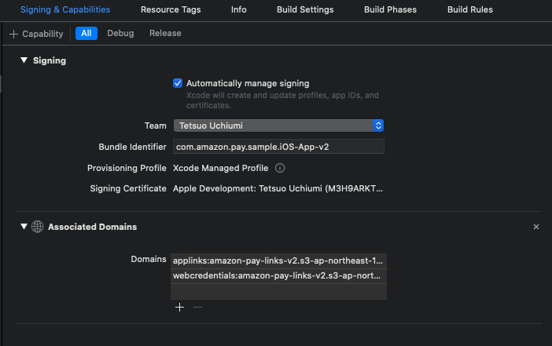
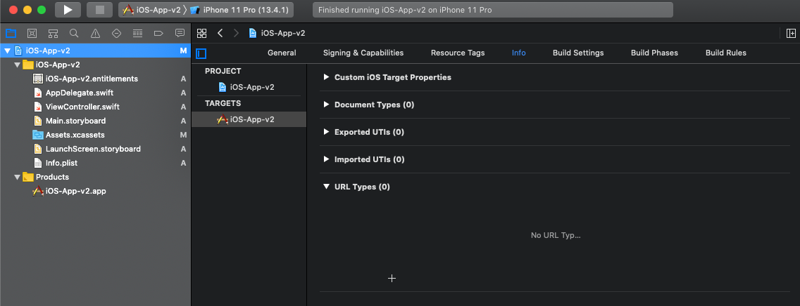
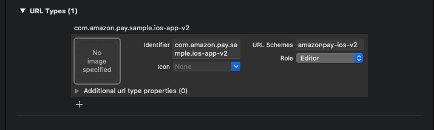

# Technology to launch apps from Secure WebView
This sample app uses "Universal Links" and "CustomURLScheme" to launch the app from Secure WebView, which have the following pros/cons respectively.
- Universal Links  
  - Pros : Secure, because the specified mobile app can be launched without fail.
  - Cons : Triggered only when the user taps the Link.
- CustomURLScheme
  - Pros : Can be triggered by JavaScript
  - Cons : Cannot completely eliminate the risk that a malicious app will be launched instead of the user.

In this sample application, we have taken these characteristics into consideration and used each of them.  
Each of them is explained below.

## Universal Links
Universal Links is a feature that allows you to launch a registered app when a specific URL Link is tapped on Safari.  
The mapping between that specific URL and the mobile app is defined in a JSON file.  
The JSON file is placed on a Server managed by the mobile app developer, and this information is loaded via the Internet when the mobile app is installed/updated.  
As long as the Server is not cracked, the mapping between the URL and the mobile app will be maintained without fail, so there is no need to worry about a malicious app being launched by mistake.  

The JSON file for mapping the URL to the app looks like the following.  

```json
{
    "applinks": {
        "apps": [],
        "details": [
            {
                "appID": "XXXXXXXXX.com.amazon.pay.sample.iOS-App-v2",
                "paths":[ "*" ]
            }
        ]
    }
}
```

The "appID" in the JSON file here consists of "{TeamID}.{Bundle Identifier}".  
You can check your TeamID by logging in to the Apple Developer Center with your Apple account and clicking "Membership" -> "Team ID".  
You can also check the Bundle Identifier in "General" and "Signing & Capabilities" of the settings in Xcode.  

Save the file created in this way as "apple-app-site-association".   

Place this "apple-app-site-association" in the Server that you are managing.  
The points to note at this point are  
  * Domain must be a different server from the web application.  
  * The file must be accessible via https (using a valid certificate that iOS can recognize, not a self-certificate).  
  * The Content-Type when retrieving the file must be "application/json".  
  * The file should be placed the directory, "/.well-known/", directly under the root of the domain.  

You can easily fulfill the conditions above by using [Amazon S3](https://aws.amazon.com/jp/s3/).  
In this sample, we also use Amazon S3 to place "apple-app-site-association".  

Then add the Associated Domains.  
Open "Signing & Capabilities" in Xcode, and add "Associated Domains" from "+Capability" in the upper left corner.  
This operation will automatically register the Bundle Identifier of the app in "Certificates, Identifiers & Profiles" -> "Identifiers" in the Apple Developer Center.  

  

Register the following two items in Associated Domains as shown in the image above.
  * applinks:{domain of the server where the above "apple-app-site-association" is placed}  
  * webcredentials:{the domain of the server where the above "apple-app-site-association" is placed}  

Now we are ready to call the native code.  
By tapping a Link with the URL "https://{domain of the server where the 'apple-app-site-association' is placed}"/..." on SFSafariViewController, the following code added to AppDelegate.swift will be executed.

```swift
// Excerpt from AppDelegate.swift
    func application(_ application: UIApplication, continue userActivity: NSUserActivity, restorationHandler: @escaping ([ UIUserActivityRestoring]?) -> Void) -> Bool {
        print("Universal Links!")
        if userActivity.activityType == NSUserActivityTypeBrowsingWeb {
            print(userActivity.webpageURL!)
                :
        }
        return true;
    }
```

Note: The above is for Swift 5, and the following for Swift 4 and earlier.
```swift
    func application(_ application: UIApplication, continue userActivity: NSUserActivity, restorationHandler: @escaping ([Any]? -> Void) -> Bool {
        print("Universal Links!")
        if userActivity.activityType == NSUserActivityTypeBrowsingWeb {
            print(userActivity.webpageURL!)
                :
        }
        return true;
    }
```

As mentioned above, the above code is only activated when you tap on the URL "https://{domain of the server where 'apple-app-site-association' is placed}/...". It will not be activated even if this URL is loaded by JavaScript.  

## CustomeURLScheme
CustomURLScheme is a mechanism to define a URL scheme for your mobile app to be called from iOS.

On XCode, click the following "+" in "URL Types" under "info".

  

Then the following input form will be displayed.  
For identifier, enter a string that will be unique within the device.  
In URL Schemes, enter a value to call your mobile app. It is recommended to specify a string that is long enough to avoid accidental confusion with other mobile apps.

  

Now we are ready to call the Native code.  
When you call the URL "{URL Schemes defined above in XCode}://..." on SFSafariViewController, the following code added to AppDelegate.swift will be executed.

```swift
// Excerpt from AppDelegate.swift
    func application(_ app: UIApplication, open url: URL, options: [UIApplication.OpenURLOptionsKey : Any] = [:]) -> Bool {
        print("Custom URL Scheme!")
                :
    }
```

In this sample application, this one is launched using JavaScript as shown below.

```html
<!-- Excerpt from nodejs/views/static/dispatcher.html (Some parts have been modified to make it easier to read.) -->
<script type="text/javascript" charset="utf-8">
        :
    location.href = "amazonpay-ios-v2://thanks";
        :
</script>
```

As you can see from the above configuration, there is no way to completely prevent a malicious mobile app from registering the exact same URL Scheme, and there is no regulation on how to behave when there are multiple apps with the same URL Scheme registered on the same device, making it unsuitable as a means to send sensitive information to the mobile app side.
