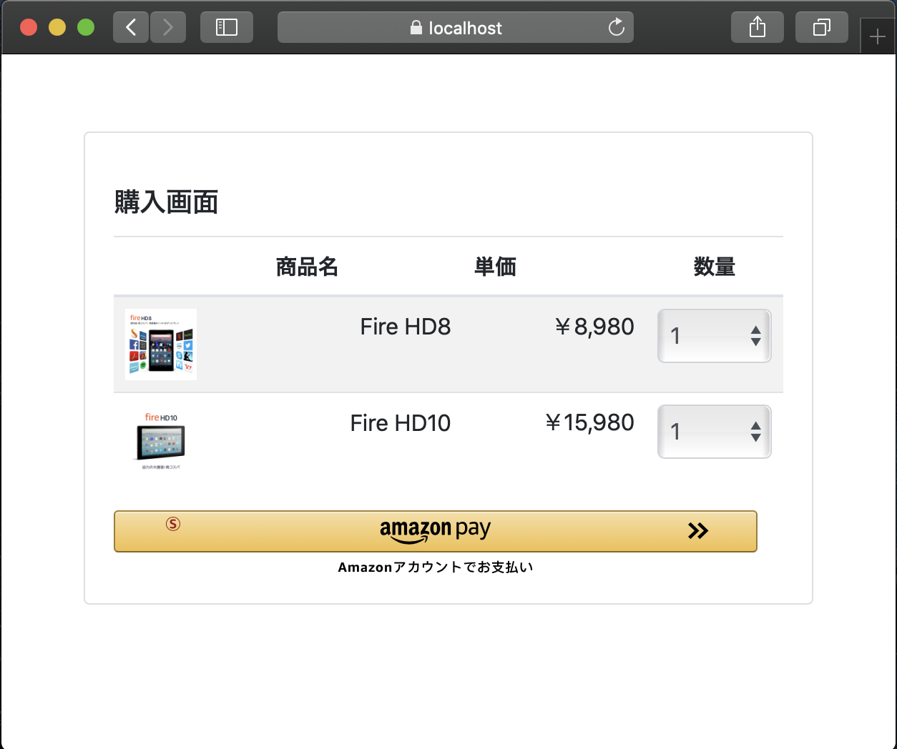

# Amazon Pay モバイル サンプルアプリ Webアプリケーション側の実装について
本サンプルアプリ全体の、Webアプリケーション側の実装です。

## 動作環境
nodejs: v12.16.1 以上  
※ おそらくもっと下のVersionでも動作しますが、動作テストはしていません。  
(参考) インストーラー & package managerを使ったインストール:  
  - https://nodejs.org/ja/download/
  - https://nodejs.org/ja/download/package-manager/

## 概要
本Webアプリケーションでは、WebView・Secure WebViewからのrequest受付・画面の出力 及び 画面遷移・Amazon Pay APIの呼出＆決済処理等を行っております。  
より詳細な動作については、[android](../android/README.md)、[ios](../ios/README.md)側の説明や、コードをご参照下さい。

# server側のインストール

## リポジトリのclone
もしまだであれば、まずは本リポジトリをcloneして下さい。  
```
git clone https://github.com/amazonpay-labs/amazonpay-sample-app-v2.git
```
cloneされてできたディレクトリの下の「nodejs」ディレクトリの下が、こちらのWebアプリケーションのプロジェクトになります。  

## Seller Centralでのアプリケーション作成・設定
nodejs/keys/template ディレクトリ下の、
  - keyinfo.js  
  - privateKey.pem

を一階層上の nodejs/keys ディレクトリ直下にコピーします。  

[Seller Central](https://sellercentral.amazon.co.jp/)にて、本サンプル用にアプリケーションを用意し、[こちら](https://amazonpaycheckoutintegrationguide.s3.amazonaws.com/amazon-pay-checkout/get-set-up-for-integration.html#5-get-your-public-key-id)を参考に、Merchant ID, Public Key ID, Store ID, Private Keyを取得し、それぞれ下記にコピーします。
  * Merchant ID: nodejs/keys/keyinfo.js の merchantId
  * Public Key ID: nodejs/keys/keyinfo.js の publicKeyId
  * Store ID: nodejs/keys/keyinfo.js の storeId
  * Private Key: nodejs/keys/privateKey.pem

## Webサーバーのhttps設定
[こちら](./ssl/README.md)のコマンドを実行し、https通信用の鍵と証明書を作成します。

## 依存モジュールのインストール
本ディレクトリにて、下記のコマンドを実行して依存モジュールをインストールします。
```sh
npm i
```

## サーバーの起動
本ディレクトリにて、下記コマンドを実行します。
```sh
node app.js
```

### browserでのテスト
[https://localhost:3443/sample/cart](https://localhost:3443/sample/cart) にアクセスします。セキュリティの警告を無視してすすめると、下記画面が表示されます。


本サンプルアプリはPC/Mobile上のブラウザでも動作しますので、アプリの動作の確認や挙動の理解にご活用ください。
